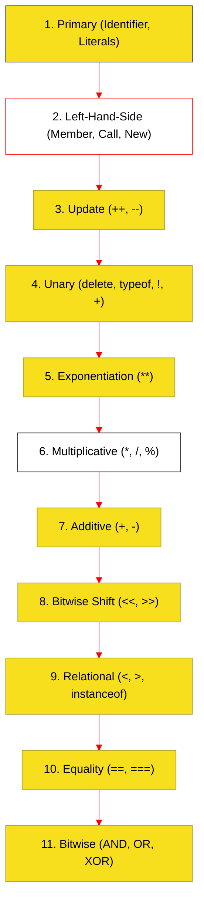

# BK-02: Unary and Binary Operators
# BK-02: Expression Mechanics (Clause 13)

> **"Generator Nilai: Bagaimana Hub Mengevaluasi Operasi Atomik Menjadi Hasil Akhir yang Bermakna."**

---

## 🌓 1. Essence: The Narrative

### Dual Definition
- **Formal**: Spesifikasi mengenai evaluasi sintaksis yang menghasilkan **Value** atau **Reference**. Mencakup hierarki presedensi operator, asosiativitas (Left-to-Right / Right-to-Left), dan transformasi tipe (Coercion) selama proses kalkulasi.
- **Analogi**: Bayangkan sebuah **Kalkulator Saintifik**. Anda memasukkan deretan angka dan operator. Kalkulator tersebut tidak melakukan perhitungan secara acak; ia mengikuti aturan **BODMAS/PEMDAS** (Presedensi). Di JavaScipt, Buku ini adalah "Buku Manual" yang menjelaskan urutan roda gigi mana yang berputar lebih dulu saat Anda menulis `a + b * c`.

---

## 🗺️ 2. Visual Logic: The Precedence Tree

Hierarki evaluasi dari unit terkecil (Primary) hingga operasi tingkat tinggi:

---

## 🏛️ 3. Strategic Chapters (Levels 5)

Normalisasi urutan evaluasi sesuai ECMA-262:

1.  **[CH-01: Primary Units](./CH-01_PrimaryUnits/)**
    *Identifier, Literal, Array/Object Initializer, dan Grouping.*
2.  **[CH-02: LHS and Update Mechanics](./CH-02_LHSAndUpdate/)**
    *Member access, Call expressions, New operator, dan Postfix increments.*
3.  **[CH-03: Unary and Exponentiation](./CH-03_UnaryExponentiation/)**
    *Operasi unary (void, delete) dan operator pangkat (Right-associative).*
4.  **[CH-04: Arithmetic and Shift Circuits](./CH-04_ArithmeticShift/)**
    *Multiplicative, Additive, dan sirkuit bit-shifting.*
5.  **[CH-05: Relational and Equality](./CH-05_RelationalEquality/)**
    *Perbandingan nilai, instanceof, dan perbedaan `==` vs `===`.*
6.  **[CH-06: Bitwise and Logical Operations](./CH-06_BitwiseLogical/)**
    *Operasi biner tingkat rendah dan operator logika dasar.*

---

## 🧠 4. Under-the-hood: Reference vs Value
Setiap ekspresi di JavaScript tidak selalu menghasilkan nilai mentah (Value). Beberapa ekspresi menghasilkan **Reference Record**. Inilah alasan mengapa `(a = 5)` valid, tetapi `(5 = 5)` menghasilkan `ReferenceError`. Pemahaman tentang "LHS" (Left-Hand Side) vs "RHS" (Right-Hand Side) adalah kunci untuk memahami pesan error engine.

---

## 🎖️ 5. The Gold Standard Checklist
- [x] **Normalization**: Perbaikan penomoran CH-01 hingga CH-06.
- [x] **Visual Logic**: Mermaid diagram untuk hierarki presedensi.
- [x] **Spec-Alignment**: Sinkronisasi dengan Clause 13.

---
*Buku Status: [x] Complete | [status.md](../../docs/status.md) | Kembali ke [SR-05](../README.md)*
