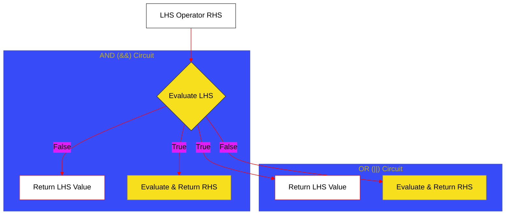

# BK-03: Logic & Assignment (Clause 13.12-13.15)

> **"Sirkuit Pengambilan Keputusan: Bagaimana Hub Menentukan Alur Data Melalui Gerbang Logika dan Terminal Penugasan."**

---

## 🌓 1. Essence: The Narrative

### Dual Definition
- **Formal**: Spesifikasi mengenai evaluasi operator logika dengan kemampuan **Short-circuiting** (AND, OR, Nullish Coalescing), operator kondisional ternary, dan mekanisme **Assignment** (Penugasan) yang melibatkan pembaruan nilai pada *Reference Records*.
- **Analogi**: Bayangkan sebuah **Sistem Irigasi Otomatis**. Air (Data) mengalir melalui pipa. Gerbang logika (`&&`, `||`) berfungsi sebagai katup otomatis: jika sensor di pipa pertama sudah mendeteksi "kering" (False pada `&&`), air tidak perlu mengalir ke pipa kedua (**Short-circuit**). Terminal penugasan (`=`) adalah tangki penyimpanan akhir di mana air tersebut disimpan untuk digunakan nanti.

---

## 🗺️ 2. Visual Logic: The Short-Circuit Gate

Bagaimana engine mengevaluasi operator logika secara efisien:

---

## 🏛️ 3. Strategic Chapters (Levels 5)

Sirkuit logika dan penugasan:

1.  **[CH-01: Conditional and Logical Operators](./CH-01_ConditionalAssignment/)**
    *Ternary operator, Short-circuiting logic (&&, ||, ??).*
2.  **[CH-02: Assignment and Comma Circuits](./CH-02_AssignmentAndComma/)**
    *Simple assignment, Compound assignments (+=, <<=), Logical assignments (&&=), dan Comma operator.*

---

## 🧠 4. Under-the-hood: The Assignment Return
Salah satu perilaku yang sering diabaikan adalah bahwa operasi penugasan (`a = b`) **mengembalikan nilai**. Nilai yang dikembalikan adalah nilai yang baru saja diberikan kepada variabel tersebut. Ini memungkinkan pola seperti `x = y = 5`. Namun, pada **Logical Assignment** (`a ||= b`), evaluasi hanya terjadi jika kondisi terpenuhi, menjaga integritas referensi jika tidak diperlukan perubahan.

---

## 🎖️ 5. The Gold Standard Checklist
- [x] **Spec-Alignment**: Sinkronisasi dengan Clause 13.12-13.15.
- [x] **Visual Logic**: Mermaid diagram untuk gerbang Short-circuit.
- [x] **Mental Model**: Analogi "Sistem Irigasi".

---
*Buku Status: [x] Complete | [status.md](../../docs/status.md) | Kembali ke [SR-05](../README.md)*
