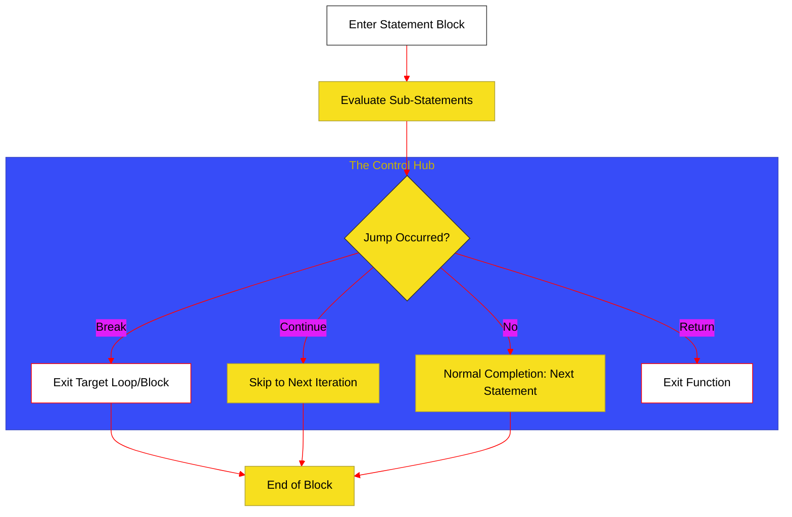

# BK-04: Statement Control (Clause 14)

> **"Sistem Navigasi & Ritme: Bagaimana Hub Mengarahkan Alur Eksekusi Melalui Blok Bersyarat dan Sirkuit Perulangan."**

---

## 🌓 1. Essence: The Narrative

### Dual Definition
- **Formal**: Spesifikasi mengenai unit-unit perintah yang tidak menghasilkan nilai (Statements) melainkan mengontrol aliran program. Mencakup pembentukan scope (Block), pemilihan jalur (If/Switch), iterasi (Loops), dan interupsi alur (Break/Continue).
- **Analogi**: Bayangkan sebuah **Rel Kereta Api**. Jalur utama adalah eksekusi linear. Pernyataan kontrol adalah **Wesel (If/Switch)** yang memindahkan kereta ke jalur berbeda, atau **Loop (Lingkaran Rel)** yang membuat kereta berputar hingga kondisi tertentu terpenuhi. Jump statements adalah **Rem Darurat (Break)** atau **Loncatan ke Stasiun Berikutnya (Continue)**.

---

## 🗺️ 2. Visual Logic: The Jump Logic Flow

Bagaimana engine menangani loncatan alur di dalam struktur kontrol:

---

## 🏛️ 3. Strategic Chapters (Levels 5)

Navigasi dan iterasi alur:

1.  **[CH-01: Blocks and Scope Environments](./CH-01_BlocksAndScope/)**
    *Block statement, Labelled statements, dan pembentukan sirkuit Lexical Environment.*
2.  **[CH-02: Selection and Iteration Circuits](./CH-02_SelectionIteration/)**
    *If/Else, Switch (Case/Default), dan seluruh varian Loop (For, While, For-In/Of/Await).*

---

## 🧠 4. Under-the-hood: Completion Records
Secara internal, setiap Statement mengembalikan sebuah **Completion Record** `{[[Type]], [[Value]], [[Target]]}`. Tipe penyelesaian bisa berupa `normal`, `break`, `continue`, `return`, atau `throw`. Engine menggunakan record ini untuk menentukan apakah ia harus melanjutkan ke baris berikutnya atau "melompat" ke target tertentu dalam stack eksekusi.

---

## 🎖️ 5. The Gold Standard Checklist
- [x] **Spec-Alignment**: Sinkronisasi dengan Clause 14.
- [x] **Visual Logic**: Mermaid diagram untuk Jump Logic.
- [x] **Mental Model**: Analogi "Rel Kereta Api".

---
*Buku Status: [x] Complete | [status.md](../../docs/status.md) | Kembali ke [SR-05](../README.md)*
