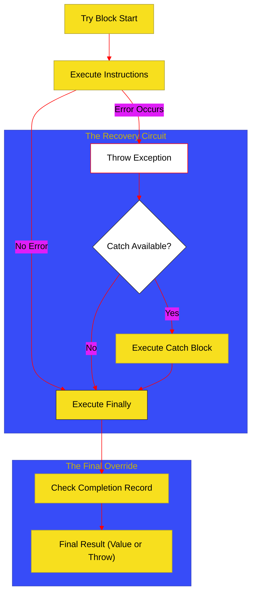

# BK-05: Exception & Interrupt (Clause 14.7, 14.15)

> **"Protokol Interupsi & Pemulihan: Bagaimana Hub Menangani Gangguan Arus Sinyal Tanpa Menghentikan Seluruh Sistem."**

---

## 🌓 1. Essence: The Narrative

### Dual Definition
- **Formal**: Spesifikasi mengenai penghentian aliran eksekusi normal melalui instruksi **Throw** dan penangkapan gangguan tersebut melalui blok **Try-Catch-Finally**. Mencakup propagasi error ke atas stack pemanggilan hingga ditemukan handler yang sesuai.
- **Analogi**: Bayangkan sebuah **Sistem Pengereman Darurat** di lift. Jika sensor mendeteksi masalah (Throw), lift akan berhenti dari jalur normalnya. Sistem akan mencari rem darurat terdekat (Catch) untuk menstabilkan situasi. Apapun yang terjadi, lampu darurat (Finally) akan tetap menyala untuk memastikan penumpang bisa keluar dengan aman.

---

## 🗺️ 2. Visual Logic: The Exception Pipeline

Mekanisme penanganan error dan prioritas blok `finally`:

---

## 🏛️ 3. Strategic Chapters (Levels 5)

Sirkuit interupsi dan pemulihan:

1.  **[CH-01: Throw and Propagation Mechanics](./CH-01_ThrowPropagation/)**
    *Mekanisme pelemparan nilai error dan bagaimana engine mencari handler di call stack.*
2.  **[CH-02: Try, Catch, and Finally Flow](./CH-02_TryCatchFinally/)**
    *Struktur penangkapan error dan logika "Always Execute" pada blok finally.*

---

## 🧠 4. Under-the-hood: Finally Power
Blok `finally` memiliki kekuatan untuk mengubah **Completion Record** dari blok `try` atau `catch`. Jika blok `try` melakukan `return 1` tetapi blok `finally` melakukan `return 2`, maka fungsi akan mengembalikan `2`. Hal ini terjadi karena `finally` adalah langkah terakhir sebelum Completion Record dikirim ke pemanggil stack berikutnya.

---

## 🎖️ 5. The Gold Standard Checklist
- [x] **Spec-Alignment**: Sinkronisasi dengan Clause 14.7 & 14.15.
- [x] **Visual Logic**: Mermaid diagram untuk Exception Pipeline.
- [x] **Mental Model**: Analogi "Pengereman Darurat Lift".

---
*Buku Status: [x] Complete | [status.md](../../docs/status.md) | Kembali ke [SR-05](../README.md)*
