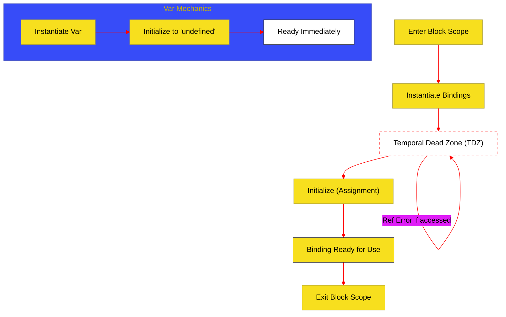

# BK-06: Declarations & Scoping (Clause 14.1-14.3)

> **"Arsitektur Ruang & Identitas: Bagaimana Hub Menentukan Batas Wilayah dan Masa Hidup dari Setiap Variabel."**

---

## 🌓 1. Essence: The Narrative

### Dual Definition
- **Formal**: Spesifikasi mengenai pembuatan **Bindings** (pengikatan nama ke nilai) di dalam Lexical Environments. Mencakup perbedaan antara deklarasi yang bersifat *Function-scoped* (`var`) dan *Block-scoped* (`let`, `const`), serta aturan aksesibilitas selama fase inisialisasi (**Temporal Dead Zone**).
- **Analogi**: Bayangkan sebuah **Gedung Perkantoran**. Setiap lantai atau ruangan adalah sebuah **Scope**. Variabel `var` seperti kurir yang memiliki kunci master untuk seluruh lantai (Function-scoped). Sedangkan `let` dan `const` adalah karyawan yang hanya boleh berada di ruangan spesifik mereka (Block-scoped). Jika Anda mencoba memanggil karyawan sebelum mereka absen masuk kerja, Anda akan dihentikan oleh satpam (**TDZ Error**).

---

## 🗺️ 2. Visual Logic: The TDZ Binding Flow

Urutan waktu dari penciptaan scope hingga variabel siap digunakan:

---

## 🏛️ 3. Strategic Chapters (Levels 5)

Sirkuit pengikatan dan ruang lingkup:

1.  **[CH-01: Var and Hoisting Mechanics](./CH-01_VarHoisting/)**
    *Tradisi lama: Function scoping dan inisialisasi otomatis ke undefined.*
2.  **[CH-02: Let, Const, and Block Scoping](./CH-02_LetConstBlock/)**
    *Aturan modern: Block scoping, TDZ, dan pengikatan immutable pada const.*

---

## 🧠 4. Under-the-hood: Lexical vs Variable Environment
Engine memisahkan penyimpanan deklarasi berdasarkan jenisnya. Deklarasi `var` disimpan di **VariableEnvironment**, sedangkan `let` dan `const` disimpan di **LexicalEnvironment**. Hal ini memungkinkan engine untuk menangani hoisting secara berbeda: `var` langsung siap dengan nilai `undefined`, sementara `let/const` tetap dalam status "uninitialized" hingga baris eksekusinya tercapai.

---

## 🎖️ 5. The Gold Standard Checklist
- [x] **Spec-Alignment**: Sinkronisasi dengan Clause 14.1-14.3.
- [x] **Visual Logic**: Mermaid diagram untuk TDZ Flow.
- [x] **Mental Model**: Analogi "Gedung Perkantoran".

---
*Buku Status: [x] Complete | [status.md](../../docs/status.md) | Kembali ke [SR-05](../README.md)*
