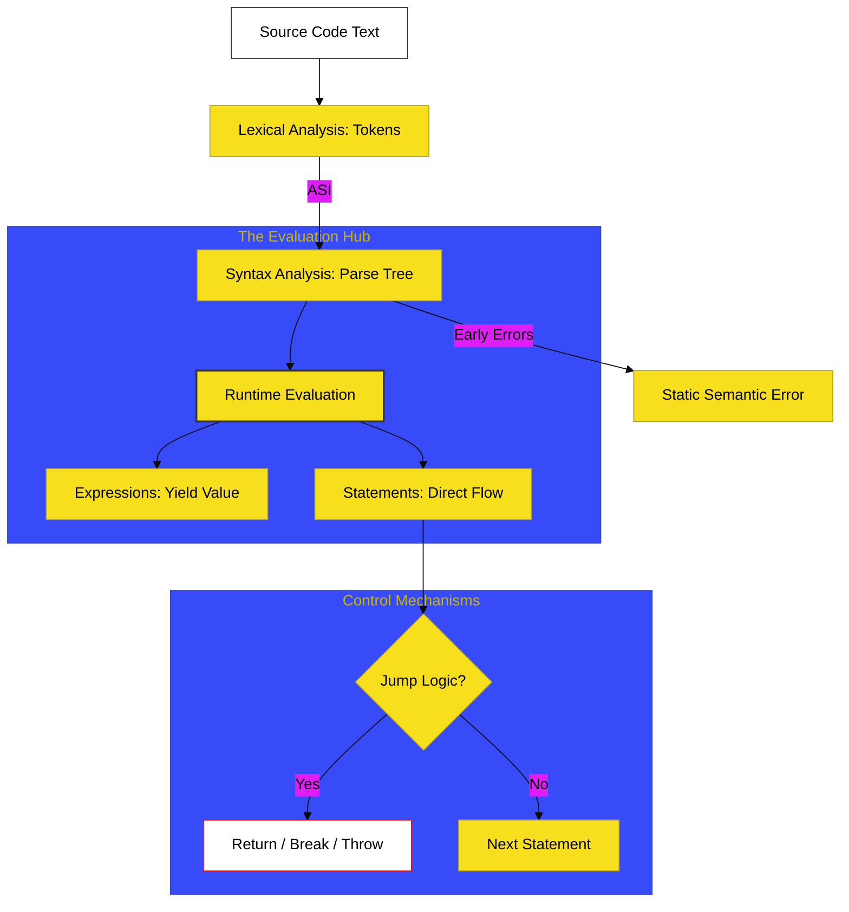

# SR-05: Grammar & Control Flow

> **"Sistem Navigasi & Transmisi: Bagaimana Input Teks Diterjemahkan Menjadi Gerakan Mekanis yang Teratur dan Terpola."**

---

## 🔗 Source Hub
- **Primary Source**: [ECMA-262: Lexical Grammar (Clause 11-12)](https://tc39.es/ecma262/#sec-ecmascript-language-lexical-grammar)
- **Technical Reference**: [ECMA-262: Expressions (Clause 13)](https://tc39.es/ecma262/#sec-ecmascript-language-expressions) & [Statements (Clause 14)](https://tc39.es/ecma262/#sec-ecmascript-language-statements-and-declarations)

---

## 🌓 1. Essence: The Narrative

### Dual Definition
- **Formal**: Spesifikasi teknis mengenai pemindaian teks (Lexical Analysis), pengelompokan simbol (Syntax Analysis), dan aturan evaluasi biner/logika yang menggerakkan alur program melalui pernyataan (Statements) dan ekspresi (Expressions).
- **Analogi**: Bayangkan sebuah **Mesin Enigma**. Anda memasukkan deretan karakter (Source Code). Mesin akan membedah karakter tersebut menjadi unit-unit bermakna (**Tokens**), menyusunnya menjadi perintah logis (**Parsing**), dan kemudian memutar roda gigi internal untuk menghasilkan aksi nyata, seperti belok kanan (**Conditionals**) atau berputar terus-menerus (**Loops**).

---

## 🗺️ 2. Visual Logic: The Execution Pipeline
Bagaimana JavaScript mengubah teks mati menjadi aksi hidup:

---

## 🏛️ 3. Strategic Books (The Tracks)

1.  **[BK-01: Lexical Grammar](./BK-01_LexicalGrammar/)**
    *Tokenization, Literals, dan mistisnya Automatic Semicolon Insertion (ASI).*
2.  **[BK-02: Expression Mechanics](./BK-02_ExpressionMechanics/)**
    *Primary expressions, Unary, Binary, dan Operator Precedence.*
3.  **[BK-03: Logic & Assignment](./BK-03_LogicAssignment/)**
    *Short-circuiting, Conditional (Ternary), dan sirkuit penugasan (Assignment).*
4.  **[BK-04: Statement Control](./BK-04_StatementControl/)**
    *Struktur blok, pemilihan (If/Switch), dan siklus perulangan (Loops).*
5.  **[BK-05: Exception & Interrupt](./BK-05_ExceptionInterrupt/)**
    *Protokol interupsi: Try, Catch, Finally, Throw, dan Return mechanics.*
6.  **[BK-06: Declarations & Scoping](./BK-06_DeclarationsScoping/)**
    *Aturan pengikatan (Bindings) variabel: Var, Let, Const, dan TDZ (Temporal Dead Zone).*

---

## 🧠 4. Under-the-hood: ASI (The Silent Guard)
Di SR-05, kita membedah **ASI (Automatic Semicolon Insertion)**. Ini bukan sekadar "kemudahan", melainkan algoritma formal di Clause 12.9 yang menentukan kapan engine harus menyisipkan titik koma secara virtual. Memahami algoritma ini adalah syarat mutlak untuk menghindari bug "Unreachable Code" yang sering terjadi pada statement `return` yang terpotong baris baru.

---
*Status: [/] Reconstruction in Progress. Mengacu pada Blueprint RAK-04.*
