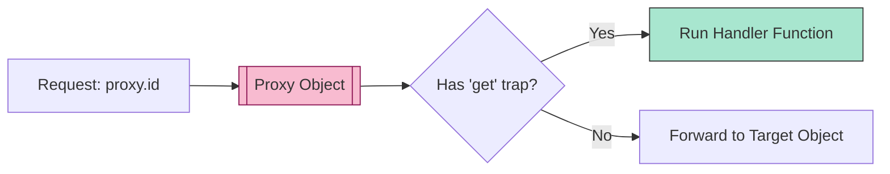

# CH-02: Bound Functions and Proxy Exotics

> **"Jembatan dan Perantara sirkuit. `Bound Functions and Proxy Exotics` adalah komponen yang bertugas membelokkan atau membungkus aliran energi eksekusi."**

**Source Hub**: 
- [ECMA-262: Proxy Exotic Objects](https://tc39.es/ecma262/#sec-proxy-exotic-objects)
- [ECMA-262: Bound Function Exotic Objects](https://tc39.es/ecma262/#sec-bound-function-exotic-objects)

---

## 1. Konsep & Esensi

**Definisi Arsitek**:
**Proxy** adalah puncak dari fleksibilitas Hub. Ia adalah objek eksotis yang mendefinisikan ulang (me-trap) SEMUA 14 metode internal. **Bound Function** adalah fungsi yang diciptakan melalui `.bind()` yang memiliki nilai `this` dan argumen awal yang terkunci secara permanen di dalam slot internalnya.

**Model Mental**:
- **Proxy**: Seorang satpam/filter di depan gedung. Setiap ada yang mau masuk (Get), keluar (Set), atau bertanya (Has), satpam tersebut bisa memutuskan apa yang harus dilakukan.
- **Bound Function**: Sebuah surat perintah yang sudah ditandatangani. Anda tidak bisa mengubah siapa pengirimnya (this) saat surat itu dijalankan.

---

## 2. Visualisasi Sistem: Proxy Interception

---

## 3. Mekanisme & Hubungan

### Kekuatan Proxy (Clause 10.5)
- Proxy dapat digunakan untuk validasi data otomatis, penayangan pembaruan secara reaktif, atau menciptakan objek virtual yang datanya tidak benar-benar ada di memori sampai diminta.

### Bound Function (Clause 10.4.1)
- Memiliki slot internal `[[BoundTargetFunction]]`, `[[BoundThis]]`, dan `[[BoundArguments]]`. Saat dipanggil, ia secara otomatis melakukan "Unpacking" pada nilai-nilai ini sebelum menjalankan fungsi aslinya.

### Arsitek Mindset: Trap Overhead
- Hati-hati: Setiap trap di Proxy adalah sirkuit tambahan. Menggunakan Proxy di dalam loop yang sangat padat (High-Frequency) akan menambah beban kerja Hub secara signifikan. Gunakan Proxy sebagai lapisan pelindung tingkat tinggi (Architecture Boundaries), bukan untuk sirkuit komputasi mikro.

---

## 4. Lab Praktis
Buka file `examples/proxy_trap_lab.js` untuk melihat bagaimana kita bisa memantau dan memblokade akses ke properti objek menggunakan Proxy.

---
*Status: [status.md](../../../../../status.md)*
