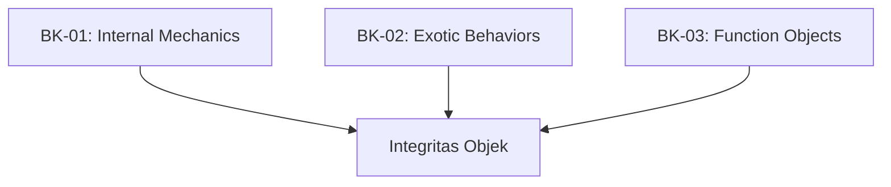

# SR-05: Ordinary and Exotic Objects (The Structural Units)

> **"Blok pembentuk materi di dalam Grid. SR-05 membedah 'Objek Biasa dan Eksotis' (The Structural Units)—bagaimana identitas dan perilaku setiap objek didefinisikan secara internal."**

**Source Hub**: 
- [ECMA-262: Ordinary and Exotic Objects Behaviors](https://tc39.es/ecma262/#sec-ordinary-and-exotic-objects-behaviors)

---

## 🏗️ The 3 Pillars of Object Architecture

---

## Koleksi Buku:
1.  **[BK-01: Object Internal Mechanics](./BK-01_ObjectInternalMechanics/)**: 14 Metode internal sakral dan Invarian objek.
2.  **[BK-02: Exotic Objects](./BK-02_ExoticObjects/)**: Perilaku khusus pada Array, String, Proxy, dan Bound Functions.
3.  **[BK-03: Function Objects](./BK-03_FunctionObjects/)**: Mesin internal di balik fungsi biasa, Generator, dan Async.

---
*Status: [status.md](../../status.md) | Back to [RAK-04](../README.md)*
