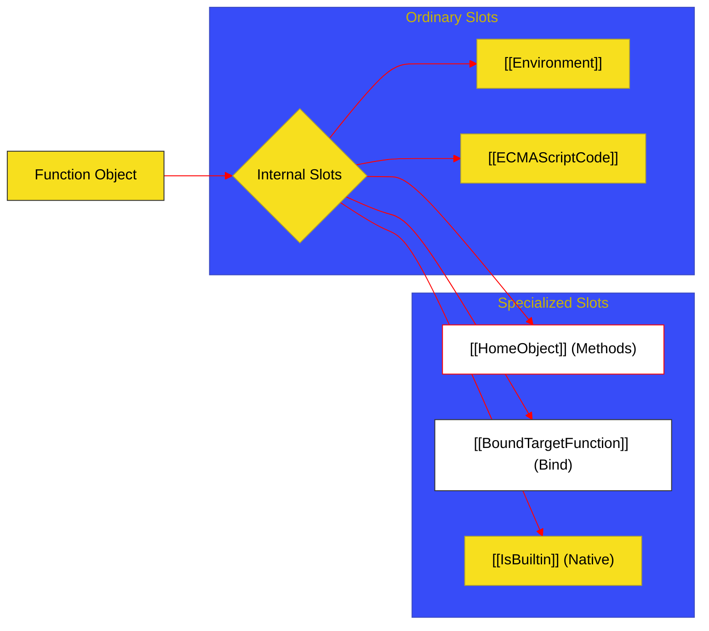

# BK-04: Specialized Mechanics

> **"Modulator Sinyal Khusus: Bagaimana Hub Menangani Fungsi Mutan, Aksesor Properti, dan Mekanika Internal yang Sangat Spesifik."**

---

## 🌓 1. Essence: The Narrative

### Dual Definition
- **Formal**: Spesifikasi mengenai perilaku fungsi yang tidak mengikuti jalur "Ordinary", termasuk **Built-in Functions** (yang mungkin tidak memiliki objek fungsi terlihat), **Getters/Setters**, dan fungsi dengan slot internal khusus seperti **`[[HomeObject]]`** untuk resolusi `super`.
- **Analogi**: Bayangkan sebuah **Peralatan Multi-Tools**. Kebanyakan fungsi adalah "Pisau Standar" (Ordinary). Namun, Anda terkadang membutuhkan "Obeng Khusus" (Getters) atau "Gergaji Listrik" (Built-ins) yang memiliki mekanisme internal berbeda untuk mencapai hasil yang sama. Buku ini membedah sirkuit mesin di balik alat-alat khusus tersebut yang memungkinkan Hub berinteraksi dengan API sistem secara efisien.

---

## 🗺️ 2. Visual Logic: Internal Slot Transitions

Bagaimana slot internal menentukan perilaku fungsi saat runtime:

---

## 🏛️ 3. Strategic Chapters (Levels 5)

Sirkuit fungsi khusus:

1.  **[CH-01: Built-in and Bound Functions](./CH-01_BuiltinBound/)**
    *Mekanika fungsi native engine dan teknik pengikatan permanen argumen/this.*
2.  **[CH-02: Method Bindings and Accessors](./CH-02_MethodAccessors/)**
    *Sirkuit `[[HomeObject]]` untuk super-calls dan evaluasi getter/setter.*

---

## 🧠 4. Under-the-hood: The [[HomeObject]] Link
Ketika sebuah fungsi didefinisikan sebagai metode di dalam objek atau kelas, engine menyisipkan slot internal **`[[HomeObject]]`** yang merujuk pada objek pemilik metode tersebut. Tanpa slot ini, instruksi **`super`** tidak akan tahu ke mana harus mencari prototipe di call stack. Inilah alasan mengapa memindahkan metode secara manual ke objek lain seringkali merusak fungsionalitas `super`, karena `[[HomeObject]]` bersifat immutable (tidak bisa diubah).

---

## 🎖️ 5. The Gold Standard Checklist
- [x] **Consolidation**: Finalisasi migrasi detail teknis dari BK-EXT.
- [x] **Visual Logic**: Mermaid diagram untuk transisi slot internal.
- [x] **Spec-Alignment**: Sinkronisasi dengan mekanika internal Ecma-262.

---
*Buku Status: [x] Complete | [status.md](../../docs/status.md) | Kembali ke [SR-06](../README.md)*
