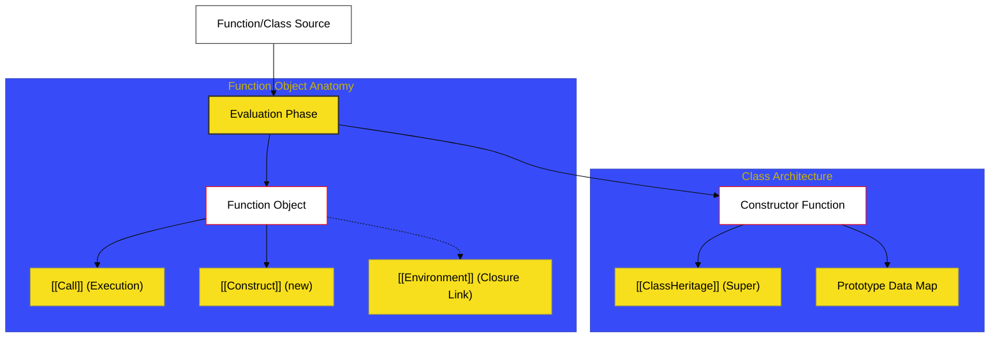

# SR-06: Functional & Class Blueprints

> **"Blueprint Pabrik & Robot: Bagaimana Instruksi Kerja Dibungkus, Dijeda, dan Diwariskan Secara Arsitektural."**

---

## 🔗 Source Hub
- **Primary Source**: [ECMA-262: Function Definitions (Clause 15.1-15.8)](https://tc39.es/ecma262/#sec-ecmascript-language-functions-and-classes)
- **Technical Reference**: [ECMA-262: Class Definitions (Clause 15.10)](https://tc39.es/ecma262/#sec-class-definitions)

---

## 🌓 1. Essence: The Narrative

### Dual Definition
- **Formal**: Spesifikasi mengenai pendefinisian, instansiasi, dan evaluasi unit logika modular melalui **Function Objects** dan **Class Constructors**. Hub ini mencakup mekanika pengikatan konteks (`this`), penangguhan eksekusi (Generators/Async), serta arsitektur pewarisan berbasis kelas (`extends`, `super`).
- **Analogi**: Bayangkan sebuah **Blueprint Arsitektur (Kelas)**. Anda bisa menggunakan blueprint tersebut untuk membangun banyak **Rumah (Instansi)**. Di dalam rumah tersebut, ada instruksi-instruksi spesifik (**Fungsi**) untuk menyalakan lampu atau air. Beberapa instruksi bersifat instan, namun ada juga instruksi yang membutuhkan waktu atau bisa dijeda (**Async/Generators**).

---

## 🗺️ 2. Visual Logic: The Creation Flow
Bagaimana engine membangun objek fungsi dan kelas dari definisi teks:

---

## 🏛️ 3. Strategic Books (The Tracks)

1.  **[BK-01: Function Definitions](./BK-01_FunctionDefinitions/)**
    *Bedah teknis Ordinary Functions, Arrow Functions, dan Metode.*
2.  **[BK-02: Async & Generators](./BK-02_AsyncGenerators/)**
    *Mekanika penangguhan (Suspension) dan Iterasi asinkron.*
3.  **[BK-03: Class Architectures](./BK-03_ClassArchitectures/)**
    *Blueprint kelas, Heritage (Pewarisan), dan Private Elements.*
4.  **[BK-04: Specialized Mechanics](./BK-04_SpecializedMechanics/)**
    *Pulsar khusus: Evaluasi generator tingkat lanjut dan async flows.*

---

## 🧠 4. Under-the-hood: [[Call]] vs [[Construct]]
Di SR-06, kita mempelajari perbedaan krusial antara fungsi biasa dan fungsi yang dipanggil dengan `new`. Secara internal, ini ditentukan oleh keberadaan internal method **`[[Construct]]`**. Arrow functions, misalnya, tidak memiliki `[[Construct]]`, itulah sebabnya mereka tidak bisa dijadikan *Constructor*. 

Memahami slot internal ini adalah kunci untuk menguasai performa dan keamanan kode di level engine, terutama saat bekerja dengan meta-programming dan library kelas tingkat tinggi.

---
*Status: [/] Reconstruction in Progress. Mengacu pada Blueprint RAK-04.*
