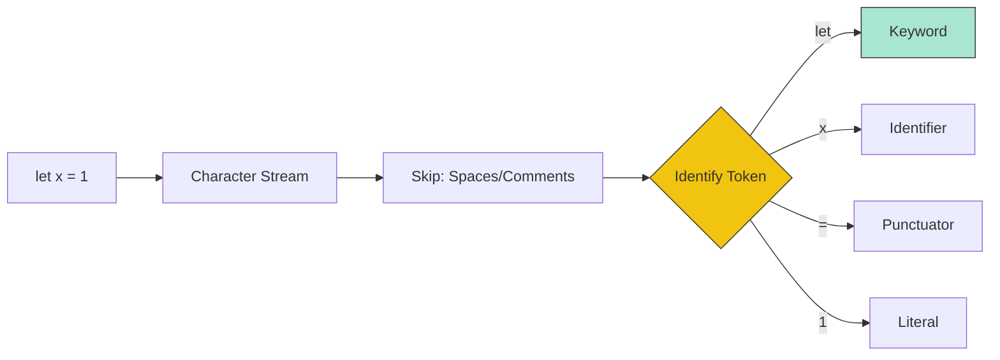

# CH-01: Tokenization and Punctuators

> **"Memecah kalimat menjadi kata. `Tokenization and Punctuators` adalah langkah pertama Hub dalam memahami niat pengembang melalui identifikasi unit-unit atomik."**

**Source Hub**: 
- [ECMA-262: Lexical Grammar Elements](https://tc39.es/ecma262/#sec-ecmascript-language-lexical-grammar)

---

## 1. Konsep & Esensi

**Definisi Arsitek**:
**Lexical Analysis** adalah proses memindai karakter Unicode satu demi satu dan mengelompokkannya menjadi elemen dasar yang disebut **Tokens**. Token terdiri dari: **Identifiers**, **Keywords**, **Punctuators**, dan **Literals**. Elemen non-token seperti White Space dan Comments akan diabaikan oleh Hub (kecuali untuk tujuan pemisahan).

**Model Mental**:
Bayangkan Hub sebagai mesin pembaca kode morse. Titik dan garis (Karakter) tidak berarti apa-apa sampai mereka dikelompokkan menjadi huruf dan kata (Tokens).

---

## 2. Visualisasi Sistem: Scanner Pipeline

---

## 3. Mekanisme & Hubungan

### Elemen Dasar (Clause 11.1-11.7)
1. **White Space & Line Terminators**: Digunakan untuk memisahkan token agar tidak menyatu (misal: `letx` vs `let x`). Line terminator juga memicu mekanisme ASI.
2. **Comments**: Diizinkan untuk dokumentasi teknis, tapi Hub akan membuang energi ini sebelum diproses ke sirkuit berikutnya.
3. **Identifiers/Keywords**: Nama variabel dan kata kunci sakral (`if`, `while`, `return`). Hub sangat peka terhadap huruf besar dan kecil (Case-Sensitive).
4. **Punctuators**: Simbol operasional seperti `{`, `}`, `(`, `)`, `;`, `,`, `.`, dst.

### Arsitek Mindset: Scanner Ambiguity
- Hub terkadang bingung membedakan antara operator pembagian `/` dan awal dari Regular Expression Literal `/regex/`. Hub menggunakan konteks sintaksis sebelumnya untuk memutuskan bagaimana karakter `/` harus di-tokenize. Ini adalah contoh "Context-Aware Tokenization".

---

## 4. Lab Praktis
Buka file `examples/tokenizer_sim.js` untuk melihat bagaimana sebuah string kode dipecah menjadi array of tokens oleh Hub secara manual.

---
*Status: [status.md](../../../../../status.md)*
