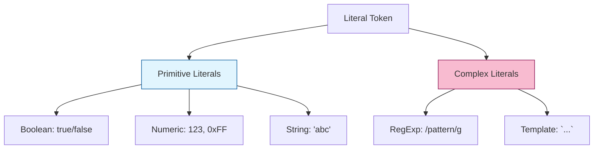

# CH-02: Literals and Template Atoms

> **"Data mentah dalam bentuk leksikal. `Literals and Template Atoms` mendefinisikan bagaimana nilai-nilai baku dituliskan langsung di dalam sirkuit Hub."**

**Source Hub**: 
- [ECMA-262: Literals](https://tc39.es/ecma262/#sec-ecmascript-language-lexical-grammar-literals)

---

## 1. Konsep & Esensi

**Definisi Arsitek**:
**Literal** adalah representasi teks dari nilai data yang tetap (constant). Hub mendukung berbagai jenis literal: Null, Boolean, Numeric, String, dan Regular Expression. Selain itu, **Template Literals** memperkenalkan "Atoms" yang memungkinkan teks memiliki ekspresi dinamis di dalamnya.

**Model Mental**:
Bayangkan sebuah kotak yang sudah berisi energi tertentu saat dipasang. Anda tidak perlu menghitung isinya; label di luar kotak (Literal) sudah menunjukkan dengan tepat apa isinya (`"Hello"`, `123`, `true`).

---

## 2. Visualisasi Sistem: Literal Types

---

## 3. Mekanisme & Hubungan

### Jenis Literal Khusus
1. **Numeric Literals (Clause 11.8.3)**: Mendukung desimal, biner (`0b`), oktal (`0o`), dan heksadesimal (`0x`). Juga mendukung pemisah digit (`1_000_000`) untuk keterbacaan tinggi.
2. **RegExp Literals (Clause 11.8.5)**: Satu-satunya literal yang menciptakan objek baru setiap kali dievaluasi secara leksikal.
3. **Template Atoms (Clause 11.8.6)**: Bagian dari template literal yang berada di antara `${ }`. Hub memperlakukannya sebagai potongan teks yang akan digabung kemudian.

### Arsitek Mindset: Static Evaluation
- Sebagian besar literal dihitung nilainya pada fase kompilasi. Semakin banyak Anda menggunakan literal yang tepat (misal: menggunakan `1n` daripada `BigInt(1)`), semakin efisien Hub memproses energi di awal siklus hidupnya.

---

## 4. Lab Praktis
Buka file `examples/literal_parsing_lab.js` untuk melihat bagaimana Hub menginterpretasikan berbagai format angka dan urutan escape di dalam string.

---
*Status: [status.md](../../../../../status.md)*
