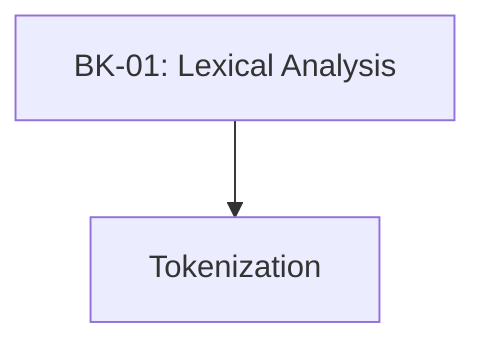

# SR-06: Lexical Grammar (The Tokenizer)

> **"Transformasi teks mentah menjadi atom-atom energi. SR-06 membedah 'Tata Bahasa Leksikal' (The Tokenizer)—bagaimana Hub memecah karakter Unicode menjadi unit yang bermakna."**

**Source Hub**: 
- [ECMA-262: Lexical Grammar](https://tc39.es/ecma262/#sec-ecmascript-language-lexical-grammar)

---

## 🏗️ The 1 Pillar of Lexical Architecture

---

## Koleksi Buku:
1.  **[BK-01: Lexical Analysis](./BK-01_LexicalAnalysis/)**: Membedah Token, Literal, dan mekanisme Automatic Semicolon Insertion (ASI).

---
*Status: [status.md](../../status.md) | Back to [RAK-04](../README.md)*
