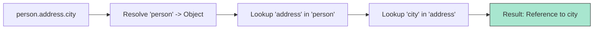

# CH-02: Left-Hand-Side and Update Ops

> **"Menembus dan Memperbarui identitas. `Left-Hand-Side and Update Ops` adalah cara Hub menelusuri hirarki objek dan mengubah muatan energi secara instan."**

**Source Hub**: 
- [ECMA-262: Left-Hand-Side Expressions](https://tc39.es/ecma262/#sec-left-hand-side-expressions)
- [ECMA-262: Update Expressions](https://tc39.es/ecma262/#sec-update-expressions)

---

## 1. Konsep & Esensi

**Definisi Arsitek**:
**Left-Hand-Side (LHS)** expressions adalah ekspresi yang menghasilkan sebuah **Reference**. Ini mencakup akses properti (`obj.prop`), pemanggilan fungsi (`func()`), dan penggunaan `new`. **Update Expressions** (increment/decrement) menggunakan referensi LHS ini untuk mengubah nilai secara langsung.

**Model Mental**:
- **LHS**: Seperti menentukan alamat tujuan paket di Hub. Sebelum Anda bisa mengirim barang (Assignment), Anda harus tahu alamat pastinya (Reference).
- **Update**: Seperti saklar putar yang menambah/mengurangi tegangan energi pada kabel yang sudah terpasang.

---

## 2. Visualisasi Sistem: Member Discovery Flow

---

## 3. Mekanisme & Hubungan

### Operasi Kritis (Clause 13.3)
1. **Member Access (`.`, `[]`)**: Menggunakan algoritma `GetValue` untuk mengambil data atau menciptakan `Reference` untuk penugasan.
2. **New Operator**: Menciptakan Realm baru untuk objek, mengikat prototipe, dan menjalankan internal method `[[Construct]]`.
3. **Optional Chaining (`?.`)**: Mekanisme bypass keamanan. Jika sirkuit di tengah jalan terputus (`null/undefined`), Hub akan langsung berhenti dan mengembalikan `undefined` daripada meledak (Error).

### Update Operators (Clause 13.4)
- **Increment/Decrement (`++`, `--`)**: Melibatkan tiga langkah spec: Baca nilai (GetValue), Tambah/Kurang (Math Value), dan Simpan kembali (PutValue). Jika diletakkan di belakang (Postfix), Hub akan menyimpan nilai lama sebagai hasil ekspresi sebelum diperbarui.

### Arsitek Mindset: Reference Safety
- Gunakan optional chaining (`?.`) untuk sirkuit yang datanya datang dari sirkuit luar (API) yang tidak bisa Anda jamin kestabilannya. Ini seperti memasang sekring otomatis agar Hub tidak mati total saat satu komponen eksternal gagal.

---

## 4. Lab Praktis
Buka file `examples/lhs_update_lab.js` untuk melihat perbedaan performa dan keamanan antara akses properti tradisional dan optional chaining.

---
*Status: [status.md](../../../../../status.md)*
