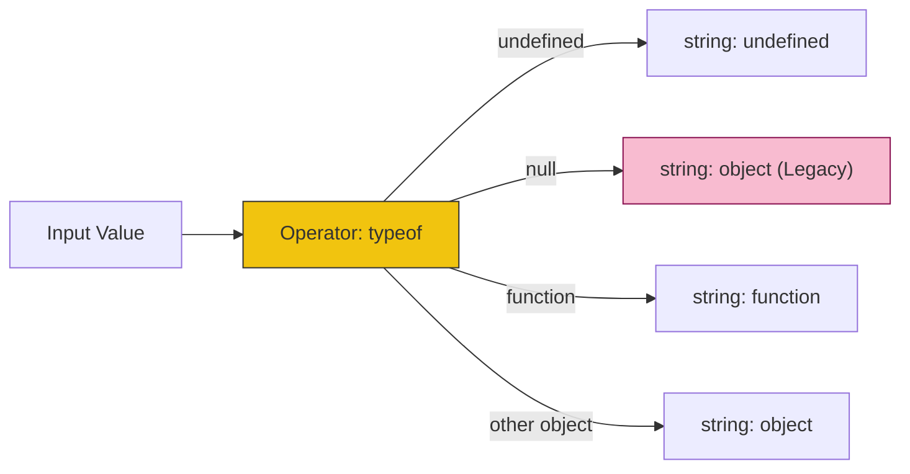

# CH-01: Unary and Exponentiation Ops

> **"Manipulasi unit tunggal dan ledakan daya. `Unary and Exponentiation Ops` adalah perintah yang mengubah muatan satu unit energi atau melakukan perhitungan daya tinggi."**

**Source Hub**: 
- [ECMA-262: Unary Operators](https://tc39.es/ecma262/#sec-unary-operators)
- [ECMA-262: Exponentiation Operator](https://tc39.es/ecma262/#sec-exponentiation-operator)

---

## 1. Konsep & Esensi

**Definisi Arsitek**:
Operator **Unary** hanya membutuhkan satu operand untuk bekerja. Ini mencakup penghapusan referensi (`delete`), pengecekan tipe (`typeof`), dan pengubahan muatan angka (Unary `+`, `-`, `~`, `!`). Operator **Exponentiation** (`**`) adalah satu-satunya operator aritmatika yang memiliki prioritas lebih tinggi daripada operator unar dalam beberapa kasus.

**Model Mental**:
- **Unary**: Seperti tombol "Reset" atau "Balikkan Arus" pada satu komponen Hub.
- **Exponentiation**: Seperti sirkuit pengganda energi yang bekerja secara eksponensial.

---

## 2. Visualisasi Sistem: Unary Typeof Matrix

---

## 3. Mekanisme & Hubungan

### Operasi Penting
1. **delete (Clause 13.5.1)**: Bukan menghapus memori, tapi menghapus properti dari objek (memutuskan sambungan). Jika sirkuit tidak bisa dihapus (Configurable: false), Hub akan mengembalikan `false`.
2. **void (Clause 13.5.2)**: Mengevaluasi ekspresi tapi selalu mengembalikan `undefined`. Digunakan untuk menjalankan sirkuit tanpa mengubah status aliran data.
3. **typeof (Clause 13.5.3)**: Mengembalikan label tipe data. Perlu waspada terhadap `typeof null` yang secara historis terdeteksi sebagai objek.
4. **Exponentiation (`**`)**: Operasi ini bekerja dari kanan ke kiri (*Right-associative*). `2 ** 3 ** 2` berarti `2 ** (3 ** 2)`.

### Arsitek Mindset: Right-Associativity
- Berbeda dengan aritmatika dasar yang berjalan dari kiri ke kanan, `**` menuntut Anda berpikir dari "Ujung Aliran" (kanan) kembali ke sumbernya. Ini krusial saat merancang sirkuit perhitungan daya tinggi.

---

## 4. Lab Praktis
Buka file `examples/unary_exponent_lab.js` untuk melihat jebakan prioritas operator antara unar `-` dan eksponen `**`.

---
*Status: [status.md](../../../../../status.md)*
