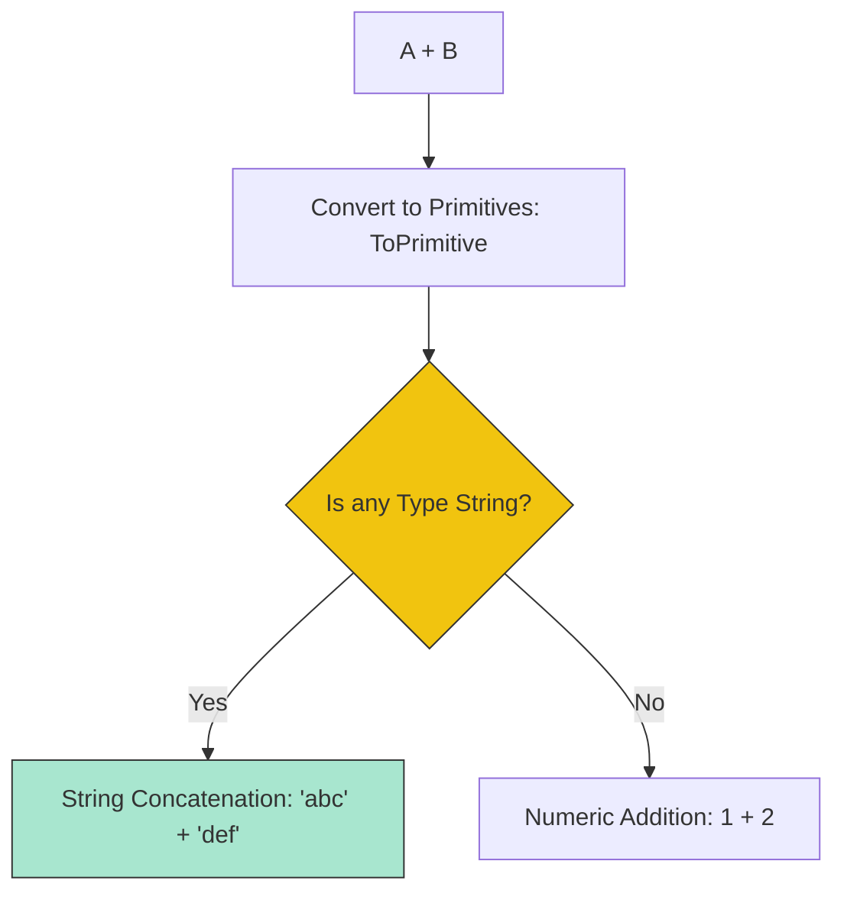

# CH-02: Arithmetic and Shift Ops

> **"Kalkulasi murni dan pergeseran biner. `Arithmetic and Shift Ops` adalah sirkuit utama yang mengubah nilai numerik melalui operasi matematika standar dan manipulasi bit."**

**Source Hub**: 
- [ECMA-262: Multiplicative Operators](https://tc39.es/ecma262/#sec-multiplicative-operators)
- [ECMA-262: Additive Operators](https://tc39.es/ecma262/#sec-additive-operators)

---

## 1. Konsep & Esensi

**Definisi Arsitek**:
Operator Aritmatika biner (`*`, `/`, `%`, `+`, `-`) melakukan perhitungan antara dua nilai. Operator **Shift** (`<<`, `>>`, `>>>`) menggeser representasi biner dari angka-angka tersebut, yang secara efektif melakukan perkalian atau pembagian dengan pangkat dua dengan kecepatan tinggi.

**Model Mental**:
- **Arithmetic**: Seperti koki yang mencampur bahan atau membagi adonan di Hub.
- **Shift**: Seperti memindahkan gigi pada mesin kendaraan; satu langkah geser berarti perbedaan daya dua kali lipat.

---

## 2. Visualisasi Sistem: Addition Algorithm (The Dual Path)

---

## 3. Mekanisme & Hubungan

### Aturan Operasional
1. **Multiplicative (Clause 13.7)**: Perkalian, Pembagian, dan Sisa Bagi (`%`). Hub mengikuti aturan IEEE 754 untuk perlakuan terhadap `Infinity` dan `NaN`.
2. **Additive (Clause 13.8)**: Operator `+` adalah operator paling "multifungsi". Jika salah satu operand adalah String, Hub akan melakukan penggabungan teks. Jika bukan, Hub akan melakukan penambahan numerik.
3. **Bitwise Shifts (Clause 13.9)**: Selalu mengubah operand menjadi integer 32-bit (untuk Number). `>>>` (Zero-fill) adalah satu-satunya yang menghasilkan angka yang selalu positif.

### Arsitek Mindset: Type Safety in Math
- Karena operator `+` sangat dinamis, pastikan Anda melakukan `ToNumber` secara eksplisit jika data datang dari sirkuit luar (User Input) agar tidak terjadi penggabungan string yang tidak diinginkan (`"1" + 2` menghasilkan `"12"`, bukan `3`).

---

## 4. Lab Praktis
Buka file `examples/arithmetic_shift_lab.js` untuk melihat perbandingan performa antara perkalian standar dan penggunaan bitwise shift untuk operasi pangkat dua.

---
*Status: [status.md](../../../../../status.md)*
