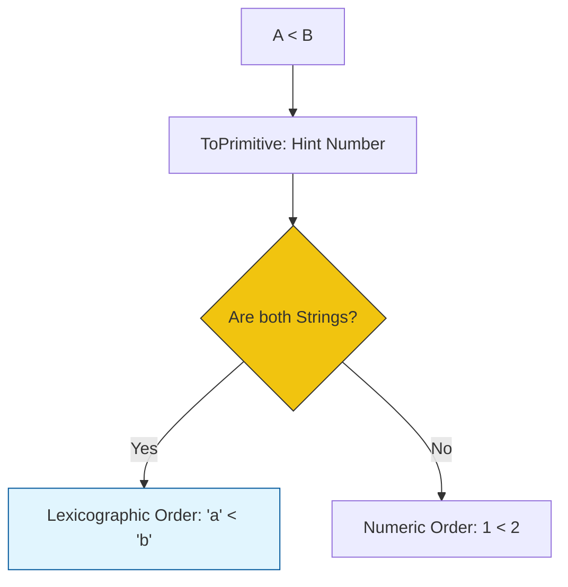

# CH-03: Relational and Equality Ops

> **"Penentuan hirarki dan identitas. `Relational and Equality Ops` adalah sirkuit logika yang memutuskan apakah sebuah unit energi lebih besar, lebih kecil, atau setara dengan unit lainnya."**

**Source Hub**: 
- [ECMA-262: Relational Operators](https://tc39.es/ecma262/#sec-relational-operators)
- [ECMA-262: Equality Operators](https://tc39.es/ecma262/#sec-equality-operators)

---

## 1. Konsep & Esensi

**Definisi Arsitek**:
Operator Relasional (`<`, `>`, `<=`, `>=`, `instanceof`, `in`) menguji hubungan antar nilai. Operator Equality (`==`, `!=`, `===`, `!==`) menguji identitas nilai tersebut. Di level spesifikasi, perbandingan ini sering melibatkan algoritma **ToPrimitive** dan **Abstract Equality Comparison**.

**Model Mental**:
Bayangkan detektor di gerbang Hub.
- **Relational**: Garis batas tinggi minimum untuk masuk (Comparison).
- **Equality**: Pemindai sidik jari untuk memastikan identitas yang tepat (Identity).

---

## 2. Visualisasi Sistem: Relational Comparison Flow

---

## 3. Mekanisme & Hubungan

### Operator Khusus
1. **instanceof (Clause 13.10.2)**: Memeriksa apakah sirkuit target (`prototype`) berada dalam rantai prototipe objek tersebut.
2. **in (Clause 13.10.1)**: Memeriksa keberadaan properti di dalam objek (termasuk rantai prototipe).
3. **Equality algorithms**:
   - `==` (Loose): Melakukan konversi tipe otomatis (Coercion). Berbahaya bagi arsitektur Hub karena tidak dapat diprediksi.
   - `===` (Strict): Memeriksa tipe DAN nilai tanpa konversi. Standar emas untuk keamanan Grid.

### Arsitek Mindset: Predictable Comparisons
- Hati-hati saat membandingkan objek dengan angka atau string. Selalu sadari bahwa Hub akan memanggil `toString()` atau `valueOf()` secara otomatis. Pastikan objek Anda memiliki perilaku perbandingan yang jelas agar tidak membingungkan teknisi lain.

---

## 4. Lab Praktis
Buka file `examples/relational_logic_lab.js` untuk melihat bagaimana Hub membandingkan string berangka (`"10" < "2"`) dan membedakannya dengan perbandingan numerik.

---
*Status: [status.md](../../../../../status.md)*
