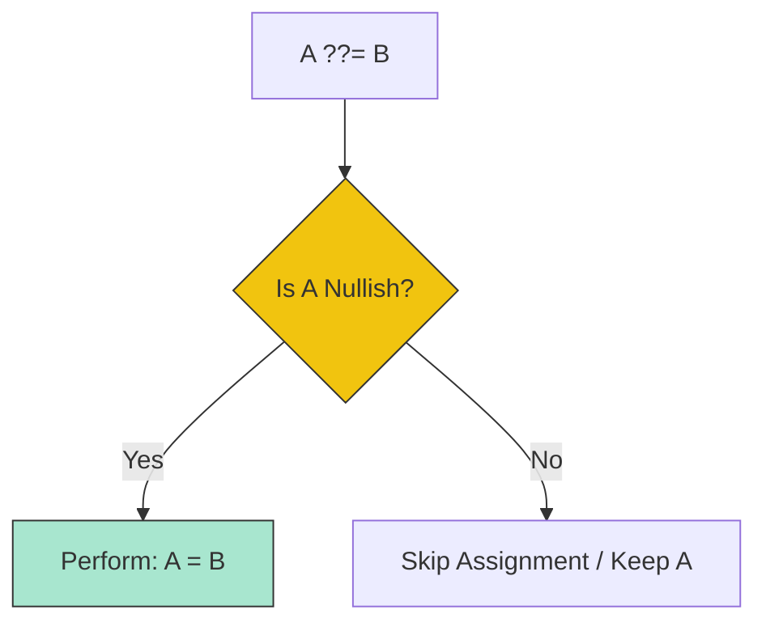

# CH-01: Conditional and Logical Assignment

> **"Logika percabangan instan. `Conditional and Logical Assignment` adalah sirkuit cerdas yang menentukan jalur energi berdasarkan kondisi saat ini."**

**Source Hub**: 
- [ECMA-262: Conditional Operator](https://tc39.es/ecma262/#sec-conditional-operator)
- [ECMA-262: Assignment Operators](https://tc39.es/ecma262/#sec-assignment-operators)

---

## 1. Konsep & Esensi

**Definisi Arsitek**:
Operator **Conditional (Ternary)** adalah satu-satunya operator yang menerima tiga operand. Ia memilih salah satu dari dua jalur eksekusi berdasarkan nilai boolean. **Logical Assignment** (`&&=`, `||=`, `??=`) adalah operator gabungan yang hanya melakukan penugasan jika kondisi sirkuit terpenuhi (Short-circuit).

**Model Mental**:
- **Conditional**: Persimpangan jalan dengan lampu lalu lintas otomatis. "Jika Lampu Hijau, ambil jalur A; Jika tidak, ambil jalur B".
- **Logical Assignment**: Saklar penghemat energi. "Hanya isi baterai (Assignment) JIKA baterai benar-benar kosong (Nullish/Logical check)".

---

## 2. Visualisasi Sistem: Logical Assignment Decision Tree

---

## 3. Mekanisme & Hubungan

### Operator Canggih
1. **Conditional (`? :`)**: Mengevaluasi operand pertama. Jika `true`, ia HANYA mengevaluasi operand kedua. Jika `false`, ia HANYA mengevaluasi operand ketiga. Ini menjamin penghematan energi (no side effects on the unchosen path).
2. **Logical OR Assignment (`||=`)**: Memberikan nilai default jika variabel saat ini "falsy".
3. **Logical AND Assignment (`&&=`)**: Hanya memperbarui nilai jika variabel saat ini sudah memiliki energi ("truthy"). Sering digunakan untuk memperbarui status konfigurasi yang sudah ada.

### Arsitek Mindset: Efficiency through Brevity
- Operator-operator ini bukan sekadar pemanis sintaksis (*Syntactic Sugar*). Mereka mengurangi jumlah langkah `GetValue` dan `PutValue` di level spec dibandingkan dengan penulisan manual `if (a) { a = b }`. Gunakan mereka untuk menjaga sirkuit tetap bersih dan performatif.

---

## 4. Lab Praktis
Buka file `examples/logic_assignment_lab.js` untuk membandingkan perilaku operator `||=` vs `??=` dalam menangani nilai `0` dan `""`.

---
*Status: [status.md](../../../../../status.md)*
