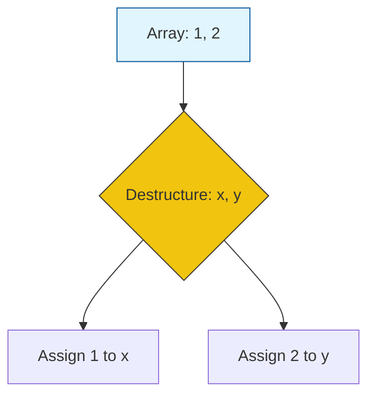

# CH-02: Assignment and Comma Operators

> **"Distribusi dan Urutan energi. `Assignment and Comma Operators` mengontrol bagaimana nilai dialirkan ke dalam kontainer dan bagaimana rentetan instruksi dijadwalkan."**

**Source Hub**: 
- [ECMA-262: Assignment Operators](https://tc39.es/ecma262/#sec-assignment-operators)
- [ECMA-262: Comma Operator](https://tc39.es/ecma262/#sec-comma-operator)

---

## 1. Konsep & Esensi

**Definisi Arsitek**:
**Assignment** (`=`) adalah operasi untuk menyimpan nilai ke dalam referensi (LHS). Hub mendukung penugasan kompleks melalui **Destructuring**. Operator **Comma** (`,`) digunakan untuk mengevaluasi beberapa ekspresi secara berurutan, namun hanya mengembalikan hasil dari ekspresi terakhir.

**Model Mental**:
- **Assignment**: Mengisi tangki penyimpanan energi di Hub.
- **Destructuring**: Membongkar paket kiriman besar dan langsung menaruh isinya ke laci-laci yang berbeda secara serentak.
- **Comma**: Seperti deretan instruksi paralel yang diakhiri dengan satu hasil final.

---

## 2. Visualisasi Sistem: Destructuring Assignment Flow

---

## 3. Mekanisme & Hubungan

### Penugasan Tingkat Lanjut
1. **Simple Assignment**: Melakukan `PutValue` pada referensi. Jika targetnya adalah properti objek, ia akan memanggil Internal Method `[[Set]]`.
2. **Destructuring (Clause 13.15.5)**: Mekanisme pola pemetaan. Hub melakukan iterasi pada sumber data dan melakukan penugasan ke target pola secara rekursif.
3. **Comma Operator (Clause 13.16)**: Jarang digunakan namun krusial dalam kontrol aliran padat (seperti di dalam loop `for`). Ia menjamin urutan eksekusi kiri-ke-kanan.

### Arsitek Mindset: Structural Clarity
- Gunakan destructuring untuk mengekstraksi data yang Anda butuhkan saja dari sirkuit luar yang besar. Ini membuat kode Anda lebih deskriptif dan mengurangi jumlah variabel sampah di dalam Environment Record Hub.

---

## 4. Lab Praktis
Buka file `examples/assignment_destructure_lab.js` untuk berlatih melakukan pertukaran nilai variabel tanpa variabel sementara (Swap) menggunakan teknik destructuring.

---
*Status: [status.md](../../../../../status.md)*
