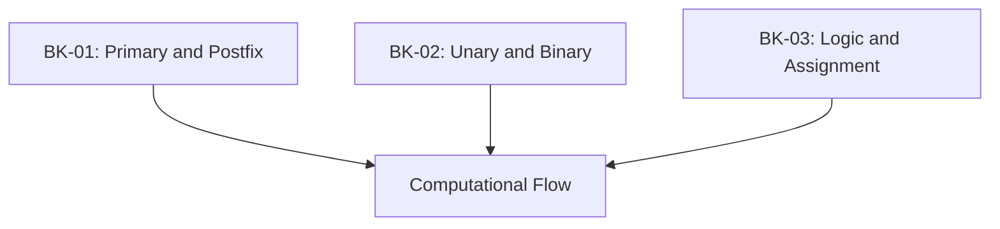

# SR-07: Expressions and Operators (The Flow Controls)

> **"Aliran pengolahan energi di dalam sirkuit. SR-07 membedah 'Ekspresi dan Operator' (The Flow Controls)—bagaimana Hub menghitung nilai dan mengubah status data."**

**Source Hub**: 
- [ECMA-262: ECMAScript Language: Expressions](https://tc39.es/ecma262/#sec-ecmascript-language-expressions)

---

## 🏗️ The 3 Pillars of Expression Architecture

---

## Koleksi Buku:
1.  **[BK-01: Primary and Postfix Expressions](./BK-01_PrimaryAndPostfix/)**: Blok bangunan dasar, akses properti, dan operator update.
2.  **[BK-02: Unary and Binary Operators](./BK-02_UnaryAndBinary/)**: Matematika spek, perbandingan, dan manipulasi bitwise.
3.  **[BK-03: Logic and Assignment](./BK-03_LogicAndAssignment/)**: Aliran logika kondisional dan distribusi nilai ke variabel.

---
*Status: [status.md](../../status.md) | Back to [RAK-04](../README.md)*
