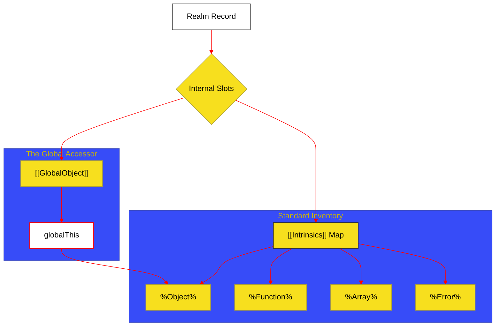

# BK-01: Global Infrastructure (Clause 19)

> **"Pusat Komando & Inventaris: Bagaimana Hub Menginisialisasi Objek Global dan Menyediakan Komponen Intrinsik untuk Seluruh Ekosistem."**

---

## 🌓 1. Essence: The Narrative

### Dual Definition
- **Formal**: Spesifikasi mengenai pembuatan **Global Object** dan pendaftaran **Intrinsic Objects** di dalam sebuah **Realm Record**. Mencakup penyediaan `globalThis` sebagai akses universal dan isolasi sumber daya antar realm yang berbeda.
- **Analogi**: Bayangkan sebuah **Server Room** di gedung perkantoran. Sebelum karyawan (kode) masuk, server harus sudah menyala dan sistem operasi sudah memuat aplikasi dasar (Intrinsics). Setiap lantai (Realm) memiliki salinanOS-nya sendiri; meskipun terlihat sama, server di Lantai 1 tidak bisa langsung mengakses data di Lantai 2 tanpa protokol khusus. `globalThis` adalah interkom yang bisa dihubungi dari ruangan mana pun untuk mengakses layanan pusat.

---

## 🗺️ 2. Visual Logic: The Realm Intrinsics Map

Bagaimana objek standar terdaftar di dalam struktur internal engine:

---

## 🏛️ 3. Strategic Chapters (Levels 5)

Infrastruktur dan dasar global:

1.  **[CH-01: The Global Object and globalThis](./CH-01_GlobalObject/)**
    *Properti global, fungsi global (eval, parseInt), dan jembatan akses universal.*
2.  **[CH-02: Realm and Intrinsic Mechanics](./CH-02_Fundamentals/)**
    *Isolasi Realm, pembuatan objek intrinsik, dan slot internal [[Intrinsics]].*

---

## 🧠 4. Under-the-hood: The [[Intrinsics]] Slot
Secara internal, engine menyimpan pemetaan rahasia bernama **`[[Intrinsics]]`**. Jika Anda mengetik `[]`, engine tidak mencari kata "Array" di scope global, melainkan langsung mengambil referensi dari `%Array.prototype%` yang tersimpan di slot intrinsik Realm saat ini. Inilah alasan mengapa `instanceof` gagal di antar-iframe; karena `%Array%` di Iframe A berbeda dengan `%Array%` di Iframe B.

---

## 🎖️ 5. The Gold Standard Checklist
- [x] **Spec-Alignment**: Sinkronisasi dengan Clause 19.
- [x] **Visual Logic**: Mermaid diagram untuk Realm Intrinsics.
- [x] **Mental Model**: Analogi "Server Room & Realm Isolation".

---
*Buku Status: [x] Complete | [status.md](../../docs/status.md) | Kembali ke [SR-07](../README.md)*
