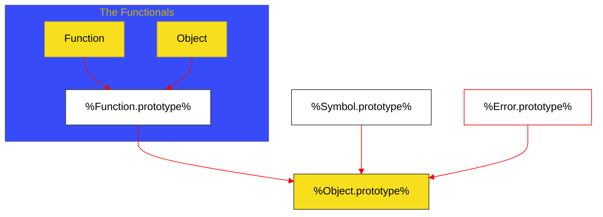

# BK-02: Fundamental Objects (Clause 20)

> **"Blok Bangunan Utama: Bagaimana Hub Mendefinisikan Objek, Fungsi, dan Simbol sebagai Fondasi Seluruh Arsitektur Data."**

---

## 🌓 1. Essence: The Narrative

### Dual Definition
- **Formal**: Spesifikasi mengenai objek-objek dasar yang menyediakan fungsionalitas inti bagi seluruh objek lainnya. Mencakup **Object** (akar prototype), **Function** (unit eksekusi), **Boolean** (logika biner), **Symbol** (identitas unik), dan **Error** (protokol kegagalan).
- **Analogi**: Bayangkan sebuah **Set Lego Dasar**. Sebelum Anda membangun kastil atau mobil yang rumit, Anda membutuhkan kepingan-kepingan standar: balok pondasi (**Object**), konektor untuk menggerakkan sesuatu (**Function**), penanda warna yang tidak bisa diduplikasi (**Symbol**), dan peringatan jika ada kepingan yang tidak pas (**Error**). Tanpa kepingan dasar ini, struktur yang lebih besar tidak mungkin bisa berdiri.

---

## 🗺️ 2. Visual Logic: Fundamental Prototypes

Rantai warisan dari objek-objek dasar dan bagaimana mereka saling terhubung:

---

## 🏛️ 3. Strategic Chapters (Levels 5)

Dasar-dasar objek dan identitas:

1.  **[CH-01: Object and Function Core](./CH-01_ObjectAndFunction/)**
    *Akar dari segala sesuatu: Object.prototype dan Function.prototype.*
2.  **[CH-02: Boolean, Symbol, and Error Circuits](./CH-02_BooleanSymbolError/)**
    *Tipe data fundamental, identitas unik (Symbol), dan mekanisme pelaporan error.*

---

## 🧠 4. Under-the-hood: The Symbol Identity
**Symbol** adalah satu-satunya tipe data primitif yang tidak memiliki representasi literal (kecuali melalui fungsi `Symbol()`). Setiap kali Anda memanggil `Symbol('a')`, Hub menciptakan entitas baru yang dijamin 100% unik di seluruh Realm. Inilah yang memungkinkan Hub menggunakan "Well-Known Symbols" (seperti `@@iterator`) untuk menambahkan perilaku ke objek tanpa risiko tabrakan nama dengan properti buatan pengguna.

---

## 🎖️ 5. The Gold Standard Checklist
- [x] **Spec-Alignment**: Sinkronisasi dengan Clause 20 (Object, Function, Symbol).
- [x] **Visual Logic**: Mermaid diagram untuk Fundamental Prototypes.
- [x] **Mental Model**: Analogi "Set Lego Dasar".

---
*Buku Status: [x] Complete | [status.md](../../docs/status.md) | Kembali ke [SR-07](../README.md)*
