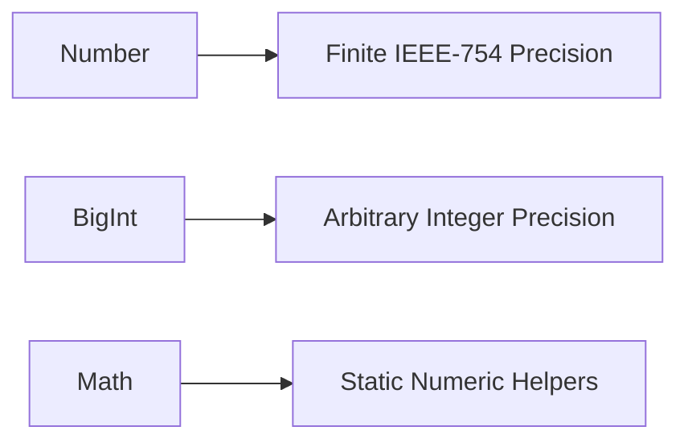

# CH-02: Mathematical Processors (Math, Number, BigInt)

> **"Unit komputasi bawaan yang membelah dunia presisi menjadi `Number`, `BigInt`, dan `Math`."**

**Source Hub**:
- [ECMA-262: Number Objects](https://tc39.es/ecma262/#sec-number-objects)
- [ECMA-262: BigInt Objects](https://tc39.es/ecma262/#sec-bigint-objects)
- [ECMA-262: The Math Object](https://tc39.es/ecma262/#sec-math-object)

---

## 1. Mental Model: "The High-Precision Core"

- **`Number`** adalah jalur komputasi umum berbasis IEEE-754.
- **`BigInt`** adalah jalur integer-preserving ketika batas `Number` tidak lagi aman.
- **`Math`** adalah toolbox statis untuk operasi numerik yang tidak memerlukan state instans.

---

## 2. Visualisasi Sistem: Numeric Processor Split

---

## 3. Mekanisme & Hubungan

1. **`Number`** cocok untuk mayoritas operasi host karena cepat dan didukung penuh oleh `Math`.
2. **`BigInt`** menjaga integritas integer besar, tetapi menolak pencampuran implisit dengan `Number`.
3. **`Math`** tidak menyimpan state per objek; ia adalah namespace built-in untuk helper numerik.

---

## 4. Lab Praktis

Buka file `examples/01_mathematical_processors_lab.js` untuk membandingkan `Math`, `Number`, dan `BigInt` dalam satu eksperimen kecil.

---

## 5. Arsitek Mindset: Pilih Unit yang Tepat

- Gunakan **`Number`** untuk mayoritas perhitungan umum dan visual.
- Gunakan **`BigInt`** untuk integer besar yang tidak boleh kehilangan bit signifikan.
- Gunakan **`Math`** sebagai helper statis, bukan sebagai objek yang perlu diinstansiasi.

---
*Status: [x] Complete | [status.md](../../../docs/status.md)*
