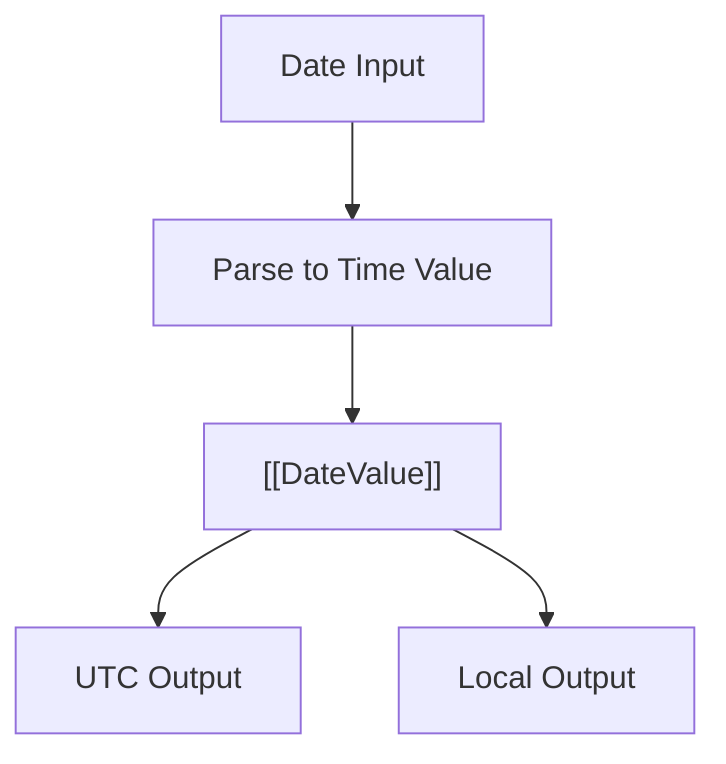

# CH-02: Time Synchronization (Date)

> **"Representasi waktu built-in yang sederhana di API, tetapi sarat proyeksi UTC, lokal, dan mutabilitas."**

**Source Hub**:
- [ECMA-262: Date Objects](https://tc39.es/ecma262/#sec-date-objects)

---

## 1. Mental Model: "The Millisecond Counter"

`Date` menyimpan waktu sebagai nilai numerik yang dihitung dari epoch.
- **UTC** memberi basis universal.
- **Local time** adalah proyeksi host terhadap nilai yang sama.
- **Mutability** membuat satu instans `Date` dapat berubah di tempat.

---

## 2. Visualisasi Sistem: Date Value Flow

---

## 3. Mekanisme & Hubungan

1. `Date` menyimpan satu **time value** internal, bukan struktur tanggal yang kaya secara intrinsik.
2. Zona waktu host memengaruhi bagaimana nilai itu diproyeksikan ke output lokal.
3. Mutabilitas `Date` menjadikannya rawan bug saat satu instans dibagi lintas alur logika.

---

## 4. Lab Praktis

Buka file `examples/01_time_synchronization_lab.js` untuk melihat perbedaan `Date.now()`, `toISOString()`, dan pembacaan komponen lokal.

---

## 5. Arsitek Mindset: Disiplin Waktu

- Simpan waktu antar-sistem sebagai timestamp atau ISO string.
- Jangan terlalu percaya pada manipulasi manual `Date` untuk kasus lintas zona waktu yang kompleks.
- Perlakukan `Date` sebagai built-in legacy yang tetap perlu dipahami walau ada arah evolusi ke API yang lebih modern.

---
*Status: [x] Complete | [status.md](../../../docs/status.md)*
