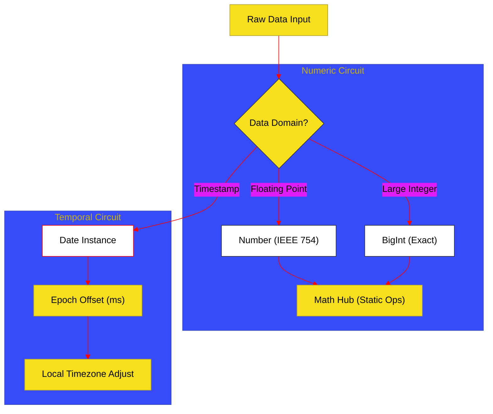

# BK-03: Numbers & Dates (Clause 21)

> **"Akurasi & Sinkronisasi: Bagaimana Hub Mengelola Energi Numerik dengan Presisi Tinggi dan Menyelaraskan Detak Waktu di Seluruh Sistem."**

---

## 🌓 1. Essence: The Narrative

### Dual Definition
- **Formal**: Spesifikasi mengenai representasi data numerik melalui tipe **Number** (64-bit IEEE 754) dan **BigInt** (arbitrary precision), serta pemrosesan matematis statis (**Math**) dan manajemen waktu absolut (**Date**).
- **Analogi**: Bayangkan sebuah **Pusat Pengukuran Nasional**. Di satu sisi terdapat tim timbangan presisi (**Number**) yang sangat cepat untuk berat standar, dan tim timbangan raksasa (**BigInt**) untuk menghitung berat hingga ke atom terkecil tanpa pembulatan. Di sisi lain, terdapat jam atom pusat (**Date**) yang memastikan semua orang di gedung memiliki referensi waktu yang sama sejak hari pembukaan gedung (**Unix Epoch**).

---

## 🗺️ 2. Visual Logic: The Numeric & Time Pipeline

Bagaimana data numerik dan waktu diproses secara internal:

---

## 🏛️ 3. Strategic Chapters (Levels 5)

Komputasi dan dimensi waktu:

1.  **[CH-01: Numbers and BigInt Precision](./CH-01_NumericPrecision/)**
    *Batas IEEE 754, MAX_SAFE_INTEGER, dan integritas bit pada BigInt.*
2.  **[CH-02: The Math Processor Hub](./CH-03_MathematicalProcessors/)**
    *Namespace Math: Trigonometri, logaritma, dan algoritma pembulatan.*
3.  **[CH-03: Temporal Records and Global Dates](./CH-02_MathTime/)**
    *Infrastruktur Date: Unix Epoch, manipulasi milidetik, dan sirkuit zona waktu.*

---

## 🧠 4. Under-the-hood: The 2^53 Limit
Tipe **Number** menggunakan format 64-bit di mana hanya 53 bit yang dialokasikan untuk mantissa (angka signifikan). Inilah yang menciptakan batas **`Number.MAX_SAFE_INTEGER`**. Di atas angka ini, Hub mulai "menebak" atau kehilangan presisi karena tidak ada cukup bit untuk mewakili integer secara unik. **BigInt** menyelesaikan ini dengan mengalokasikan memori secara dinamis, memungkinkan presisi yang hanya dibatasi oleh memori sistem.

---

## 🎖️ 5. The Gold Standard Checklist
- [x] **Spec-Alignment**: Sinkronisasi dengan Clause 21 (Number, Math, Date).
- [x] **Visual Logic**: Mermaid diagram untuk Numeric & Time Pipeline.
- [x] **Consolidation**: Penggabungan materi Math dan Date dari BK-02/BK-05.

---
*Buku Status: [x] Complete | [status.md](../../docs/status.md) | Kembali ke [SR-07](../README.md)*
