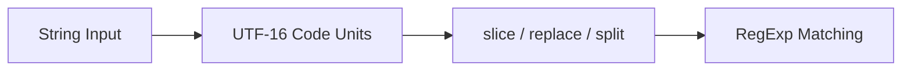

# CH-01: Character Mapping (Strings & RegExp)

> **"Representasi teks yang tampak sederhana, tetapi menyimpan detail Unicode dan pola pencarian di balik layar."**

**Source Hub**:
- [ECMA-262: String Objects](https://tc39.es/ecma262/#sec-string-objects)
- [ECMA-262: RegExp Objects](https://tc39.es/ecma262/#sec-regexp-objects)

---

## 1. Mental Model: "The Text Transmitter"

- **`String`** merepresentasikan teks sebagai deretan UTF-16 code units.
- **`RegExp`** bertindak sebagai mesin pencarian pola di atas representasi string yang sama.
- Hubungan keduanya penting karena banyak edge case teks muncul di pertemuan antara representasi dan pencocokan.

---

## 2. Visualisasi Sistem: Text Processing Flow

---

## 3. Mekanisme & Hubungan

1. **String** memakai UTF-16, sehingga beberapa karakter visual dapat memakan dua unit indeks.
2. **RegExp** memproses teks berdasarkan representasi internal itu, bukan berdasarkan "jumlah karakter visual" semata.
3. Inilah alasan mengapa pembaca perlu memahami surrogate pairs dan normalisasi Unicode.

---

## 4. Lab Praktis

Buka file `examples/01_character_mapping_lab.js` untuk melihat surrogate pairs, normalisasi Unicode, dan pencarian pola sederhana dalam satu eksperimen.

---

## 5. Arsitek Mindset: Efisiensi Teks

- Gunakan template literals untuk ekspresi teks yang lebih terbaca.
- Waspadai status `lastIndex` pada regex global.
- Perlakukan teks internasional sebagai domain yang punya biaya semantik, bukan sekadar "string biasa".

---
*Status: [x] Complete | [status.md](../../../docs/status.md)*
