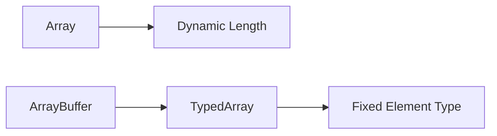

# CH-01: Ordered Streams (Arrays & TypedArrays)

> **"Koleksi terindeks untuk data dinamis dan data biner yang disiplin."**

**Source Hub**:
- [ECMA-262: Indexed Collections](https://tc39.es/ecma262/#sec-indexed-collections)
- [ECMA-262: TypedArray Objects](https://tc39.es/ecma262/#sec-typedarray-objects)

---

## 1. Mental Model: "The Number Line"

- **`Array`** adalah koleksi dinamis dengan operasi transformasi tingkat tinggi.
- **TypedArray** adalah representasi elemen bertipe tetap di atas `ArrayBuffer`.
- Keduanya sama-sama berindeks, tetapi kontrak memorinya berbeda jauh.

---

## 2. Visualisasi Sistem: Ordered Collection Pipeline

---

## 3. Mekanisme & Hubungan

1. **Array** dioptimalkan untuk akses berindeks dan transformasi deklaratif seperti `map` dan `filter`.
2. **TypedArray** mengikat representasi data ke `ArrayBuffer`, sehingga cocok untuk data biner atau interop performa tinggi.
3. Perbedaan kontrak inilah yang menjelaskan mengapa `Array` dan TypedArray tidak boleh dianggap substitusi total satu sama lain.

---

## 4. Lab Praktis

Buka file `examples/01_ordered_streams_lab.js` untuk membandingkan array dinamis dan TypedArray dalam satu eksperimen singkat.

---

## 5. Arsitek Mindset: Pilih Pipa yang Tepat

- Gunakan **Array** untuk logika bisnis umum dan manipulasi data tingkat tinggi.
- Gunakan **TypedArray** saat Anda membutuhkan layout data yang lebih dekat ke memori mentah.
- Pahami kapan kebutuhan Anda adalah fleksibilitas struktur dan kapan kebutuhan Anda adalah disiplin representasi.

---
*Status: [x] Complete | [status.md](../../../docs/status.md)*
