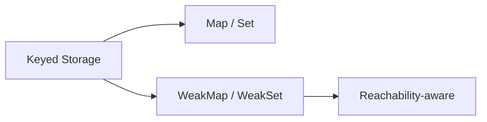

# CH-02: Keyed Storage (Map, Set, WeakMap, WeakSet)

> **"Gudang kunci yang memisahkan koleksi kuat dan koleksi lemah."**

**Source Hub**:
- [ECMA-262: Keyed Collections](https://tc39.es/ecma262/#sec-keyed-collections)

---

## 1. Konsep dan Peran Chapter

Chapter ini sekarang berfungsi sebagai **hub** untuk keluarga koleksi berbasis kunci. Domain ini dipecah menjadi dua section agar hirarki `BK -> CH -> SEC` kembali valid:

- **[SEC-01: Maps and Sets](./SEC-01_MapsAndSets/)**  
  Koleksi kuat dengan insertion order, lookup berbasis identity, dan operasi iteratif.
- **[SEC-02: Weak Collections and GC](./SEC-02_WeakCollectionsAndGc/)**  
  Koleksi lemah yang kontraknya bergantung pada reachability dan garbage collection.

---

## 2. Mental Model: "The Labeling Vault"

- **`Map`**: kamus energi dengan kunci bebas dan urutan penyisipan stabil.
- **`Set`**: koleksi nilai unik untuk memastikan tidak ada duplikasi sinyal.
- **`WeakMap` / `WeakSet`**: varian ramah GC yang tidak mempertahankan objek hanya karena masih dipakai sebagai kunci.

---

## 3. Jalur Baca

Mulai dari `SEC-01` jika Anda ingin memahami perilaku koleksi kuat (`Map` dan `Set`) lebih dulu. Lanjutkan ke `SEC-02` untuk melihat bagaimana weak collections mengubah kontrak penyimpanan saat garbage collector ikut berperan.

---

## 4. Visualisasi Sistem: Keyed Storage Split

---

## 5. Lab Praktis

Gunakan `SEC-01` untuk lab `Map` dan `Set` di `examples/01_map_set_demo.js`, lalu lanjutkan ke `SEC-02` untuk melihat perilaku weak collections pada `examples/01_weak_demo.js`.

---

## 6. Arsitek Mindset

Jangan memperlakukan `Map`, `Set`, `WeakMap`, dan `WeakSet` sebagai variasi kosmetik dari objek biasa. Di level spec, masing-masing punya kontrak reachability, iteration, dan identity yang berbeda, dan pemisahan ini penting untuk menjaga boundary `RAK-04`.

---
*Status: [x] Complete | [status.md](../../../docs/status.md)*
