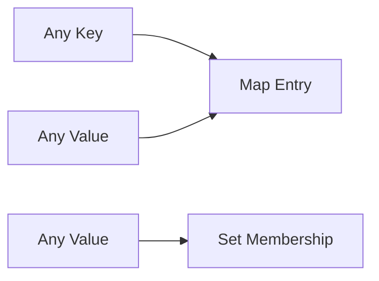

# SEC-01: Maps & Sets (Loker Cerdas)

**Source Hub**:
- [ECMA-262: Map Objects](https://tc39.es/ecma262/#sec-map-objects)
- [ECMA-262: Set Objects](https://tc39.es/ecma262/#sec-set-objects)

---

Meskipun Object dan Array sangat berguna, keduanya memiliki batasan. **Map** dan **Set** hadir untuk menyediakan struktur data yang lebih spesifik dan berkinerja tinggi pada keluarga keyed collections.

## Sistem Analogi (Mental Model)

> **Analogi Singkat:**  
> **Map** adalah **Loker Cerdas dengan Label Bebas**. Berbeda dengan loker lama (Object) yang hanya mau menerima label berupa teks, loker cerdas ini mau menerima apa pun sebagai label. **Set** adalah **Daftar Tamu Eksklusif**. Jika nama Anda sudah ada di daftar, Anda tidak bisa masuk dua kali.

> **Analogi Panjang (Resepsionis Hotel):**  
> Bayangkan seorang resepsionis hotel:
> - **Object vs Map**: buku tamu lama mereduksi kunci menjadi string.
> - **Map (Modern)**: identitas fisik tetap dibedakan.
> - **Set (Keamanan)**: daftar tamu unik mencegah duplikasi.

---

## Visualisasi Sistem

---

## Karakteristik Map

1. **Kunci Fleksibel**: bisa menggunakan objek, fungsi, atau primitif apa pun sebagai kunci.
2. **`size`**: memiliki properti ukuran yang akurat.
3. **Iterasi Stabil**: menjamin insertion order saat diiterasi.

## Karakteristik Set

1. **Uniqueness**: secara otomatis membuang nilai duplikat.
2. **Efficient Search**: pengecekan `.has(value)` sangat cepat.
3. **No Index**: Set adalah koleksi nilai unik, bukan array berindeks.

## Mengapa Arsitek Harus Peduli?

- **Performa**: `Map` lebih tepat untuk operasi penambahan dan penghapusan data dinamis.
- **Integritas Data**: `Set` menyatakan niat eksplisit bahwa duplikasi tidak diizinkan.
- **Keterbacaan**: kode yang memakai `Map` dan `Set` menunjukkan kontrak data yang lebih jelas.

## Contoh Eksekusi

Lihat bagaimana `Map` menangani kunci objek dan bagaimana `Set` menyaring duplikasi pada file `examples/01_map_set_demo.js`.

---
*Section Status: [x] Complete | [status.md](../../../../../docs/status.md)*
