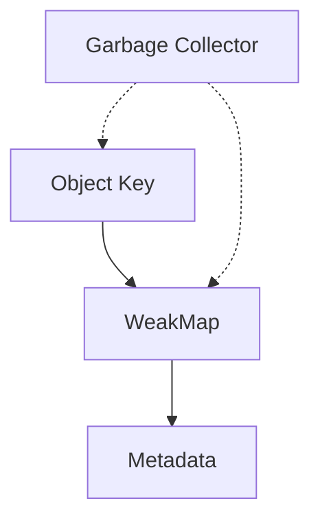

# SEC-02: Weak Collections & GC (Loker Berhantu)

**Source Hub**:
- [ECMA-262: WeakMap Objects](https://tc39.es/ecma262/#sec-weakmap-objects)
- [ECMA-262: WeakSet Objects](https://tc39.es/ecma262/#sec-weakset-objects)

---

Selain koleksi standar, JavaScript memiliki varian "lemah": **WeakMap** dan **WeakSet**. Keduanya dirancang untuk bekerja selaras dengan reachability dan garbage collection.

## Sistem Analogi (Mental Model)

> **Analogi Singkat:**  
> **WeakMap/WeakSet** adalah **Loker Berhantu**. Loker ini hanya mau menerima benda fisik (objek) sebagai kunci atau nilai, tetapi tidak memegangnya dengan erat.

> **Analogi Panjang (Sistem Tanda Pengenal Tamu):**  
> - **Map (Loker Kuat)**: data tamu tetap tersimpan sampai dibersihkan manual.
> - **WeakMap (Tanda Pengenal)**: metadata menempel selama objek masih hidup di sistem; saat objek hilang, metadata ikut hilang otomatis.

---

## Visualisasi Sistem

---

## Karakteristik Weak Collection

1. **Hanya Objek**: kuncinya atau nilainya harus berupa objek.
2. **Tidak Bisa Diiterasi**: tidak ada `.size`, `.keys()`, atau loop publik yang stabil.
3. **Weak Reference**: koleksi ini tidak mencegah garbage collector membersihkan objek.

## Kapan Arsitek Menggunakannya?

1. **Metadata Objek**: menyimpan informasi tambahan tanpa mengubah objek asli.
2. **Private Data**: menyimpan state privat yang ikut hilang saat instans hilang.
3. **Caching/Memoization**: menyimpan hasil berat yang bergantung pada identitas objek.

## Contoh Eksekusi

Lihat bagaimana data di WeakMap menghilang mengikuti siklus hidup objek pada file `examples/01_weak_demo.js`.

---
*Section Status: [x] Complete | [status.md](../../../../../docs/status.md)*
