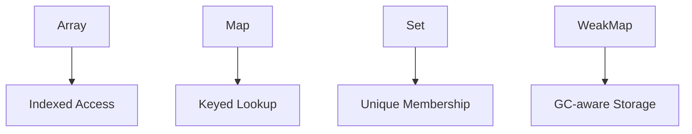

# CH-03: Indexed and Keyed Collections

> **"Gudang penyimpanan data terstruktur. `Indexed and Keyed Collections` mendefinisikan bagaimana unit data disortir dalam urutan atau dipetakan berdasarkan identitas unik."**

**Source Hub**: 
- [ECMA-262: Indexed Collections](https://tc39.es/ecma262/#sec-indexed-collections)
- [ECMA-262: Keyed Collections](https://tc39.es/keyed-collections)

---

## 1. Konsep & Esensi

**Definisi Arsitek**:
**Array** adalah koleksi berindeks numerik yang sangat dioptimalkan untuk akses urutan. **Map** dan **Set** adalah koleksi "Keyed" yang menyimpan data berdasarkan nilai asli atau identitas unik, bukan sekadar string. Varian **Weak** (WeakMap/WeakSet) memungkinkan Hub menghapus entitas dari koleksi jika tidak ada sirkuit lain yang merujuknya (Memory Safety).

**Model Mental**:
- **Array**: Rak buku dengan nomor urut.
- **Map/Set**: Meja resepsionis dengan buku tamu. Anda mendaftar menggunakan nama (Key) untuk mendapatkan nomor kamar (Value).
- **Weak Varian**: Sebuah buku tamu ajaib yang tintanya akan hilang sendiri saat orang yang terdaftar keluar dari gedung (Object GC).

---

## 2. Visualisasi Sistem: Collection Selection Matrix

---

| Koleksi | Tipe Kunci | Order | Duplikat | Kasus Penggunaan |
| :--- | :--- | :--- | :--- | :--- |
| **Array** | Numerik (0, 1...) | Fixed | YES | Daftar urut, Stack, Queue |
| **Set** | Any Value | Insertion | NO | Daftar unik (ID, Tags) |
| **Map** | Any Value | Insertion | NO (Keys) | Mapping Key-Value dinamis |
| **WeakMap** | Only Objects | No | NO | Metadata Privat, Caching |

---

## 3. Mekanisme & Hubungan

### Mekanisme Internal
1. **Array Length (Clause 23.1)**: Properti ajaib yang selalu sinkron dengan indeks tertinggi.
2. **Map/Set Hash**: Hub menggunakan algoritma penyamaan `SameValueZero` untuk memeriksa kunci. Artinya, Anda bisa menggunakan objek atau fungsi sebagai kunci di Map, berbeda dengan objek biasa yang hanya menerima string/symbol.
3. **Weak Collections (Clause 24.3-4)**: Mereka tidak bisa diiterasi (`no size()`, `no keys()`). Ini adalah trade-off arsitektural untuk memungkinkan Garbage Collector bekerja secara bebas di belakang layar.

### Arsitek Mindset: Choosing Keyed Collections
- Saat Anda membutuhkan pemetaan asosiatif yang kuncinya bukan string, atau saat Anda ingin menghindari "Prototype Pollution" yang sering terjadi pada objek biasa, selalu pilih `Map`. Ia lebih bersih, lebih cepat untuk penambahan kunci massal, dan lebih aman secara arsitektural.

---

## 4. Lab Praktis
Buka file `examples/01_collection_performance_lab.js` untuk menguji kecepatan akses data antara `Map` vs `Object` pada serangkaian entri data dinamis.

---
*Status: [x] Complete | [status.md](../../../docs/status.md)*
