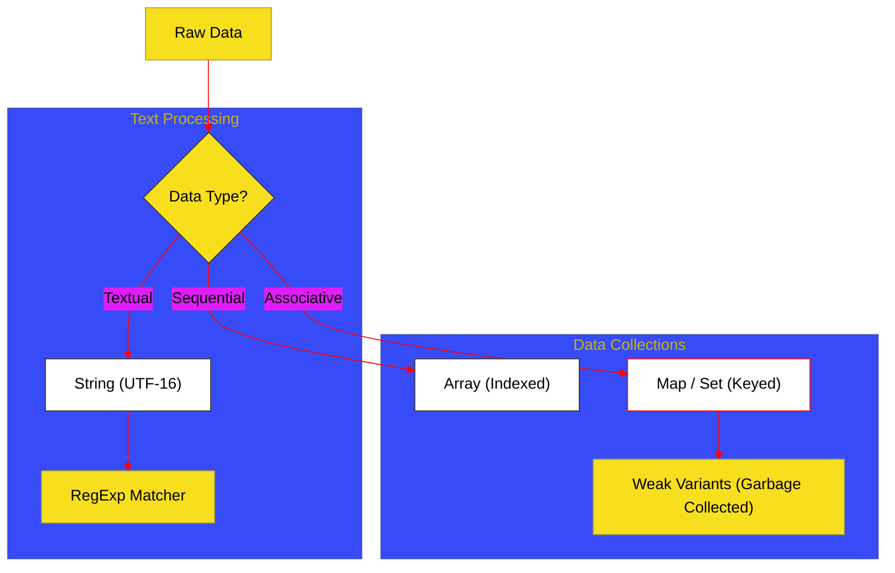

# BK-04: Text & Collections (Clause 22-24)

> **"Transmisi & Penyimpanan: Bagaimana Hub Mengolah Sinyal Tekstual dan Mengorganisir Data dalam Struktur Koleksi yang Dinamis."**

---

## 🌓 1. Essence: The Narrative

### Dual Definition
- **Formal**: Spesifikasi mengenai objek manipulasi teks (**String**, **RegExp**) dan struktur data penyimpanan (**Array**, **Map**, **Set**, **WeakMap**, **WeakSet**). Mencakup algoritma iterasi, manajemen memori pada koleksi "weak", dan pemrosesan pola melalui mesin RegExp.
- **Analogi**: Bayangkan sebuah **Kantor Logistik**. Teks adalah surat-surat puitis yang harus diproses (**String**) dan disortir berdasarkan pola alamat tertentu (**RegExp**). Koleksi adalah rak-rak penyimpanan: ada rak linear bertingkat (**Array**) yang mudah diakses dengan nomor indeks, dan ada brankas rahasia berkelompok (**Map/Set**) yang membutuhkan kunci spesifik untuk membukanya. Brankas "Weak" adalah penyimpanan sementara yang akan otomatis dihancurkan jika pemiliknya sudah tidak lagi terdaftar di gedung tersebut.

---

## 🗺️ 2. Visual Logic: The Text & Collection Pipeline

Aliran pengolahan dari data mentah hingga struktur yang terorganisir:

---

## 🏛️ 3. Strategic Chapters (Levels 5)

Struktur teks dan koleksi data:

1.  **[CH-01: String and RegExp Mechanics](./CH-01_TextProcessing/)**
    *UTF-16 code units, Surrogate pairs, dan internal matching engine RegExp.*
2.  **[CH-02: Indexed Collections (Arrays)](./CH-04_OrderedStreams/)**
    *Arsitektur Array: Length property, holey vs dense arrays, dan metode iterasi.*
3.  **[CH-03: Keyed and Weak Collections](./CH-05_KeyedStorage/)**
    *Map/Set vs WeakMap/WeakSet: Kontrak pengumpulan sampah (GC) dan efisiensi lookup.*

---

## 🧠 4. Under-the-hood: The "Weak" Contract
Koleksi tipe **WeakMap** dan **WeakSet** memiliki perilaku unik di mana mereka tidak menahan referensi objek agar tidak dihapus oleh **Garbage Collector (GC)**. Jika satu-satunya referensi ke sebuah objek hanya ada di dalam WeakMap, maka GC tetap boleh menghancurkan objek tersebut. Inilah mengapa WeakMap tidak bisa di-iterasi (non-enumerable); karena isinya bisa menghilang kapan saja secara asinkron tergantung pada jadwal kerja GC engine.

---

## 🎖️ 5. The Gold Standard Checklist
- [x] **Spec-Alignment**: Sinkronisasi dengan Clause 22-24 (Text, Array, Map/Set).
- [x] **Normalization**: Perbaikan duplikasi penomoran chapter dari audit awal.
- [x] **Visual Logic**: Mermaid diagram untuk Text & Collection Pipeline.

---
*Buku Status: [x] Complete | [status.md](../../docs/status.md) | Kembali ke [SR-07](../README.md)*
