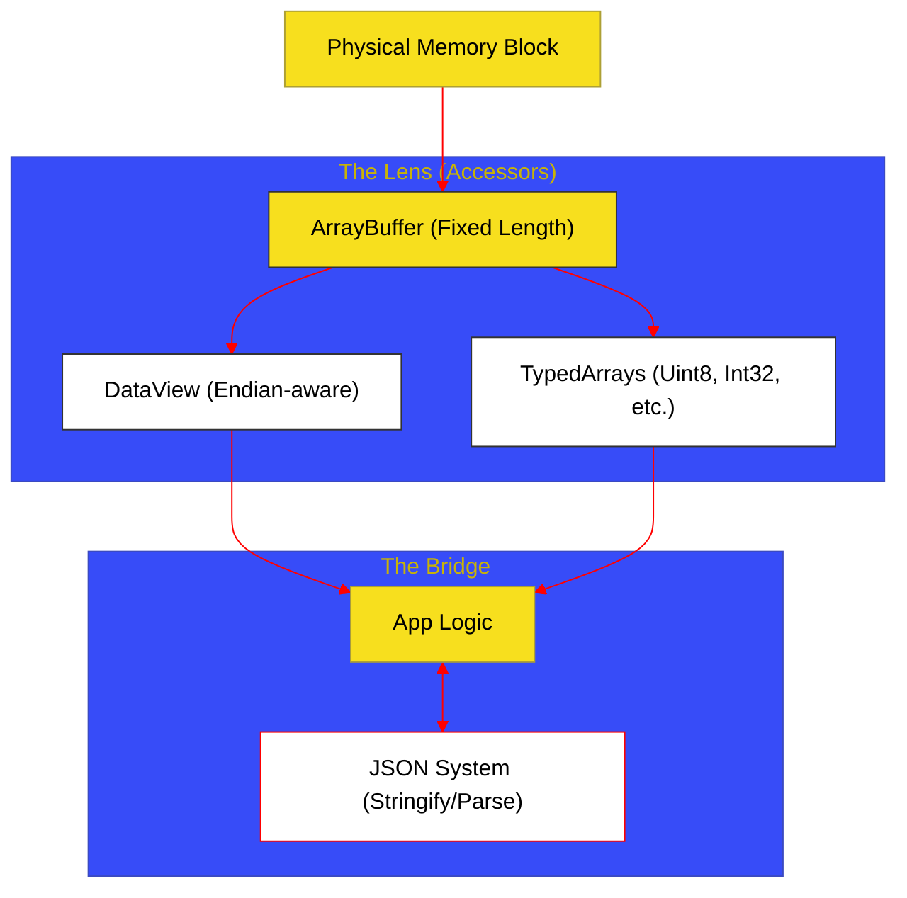

# BK-05: Structured Data (Clause 25)

> **"Pabrik Raw Data: Bagaimana Hub Mengolah Bit Mentah Melalui Buffer dan Menghubungkan Arsitektur Internal ke Format Pertukaran Eksternal (JSON)."**

---

## 🌓 1. Essence: The Narrative

### Dual Definition
- **Formal**: Spesifikasi mengenai representasi data biner Fixed-width melalui **ArrayBuffer** dan **SharedArrayBuffer**, akses terstruktur melalui **TypedArrays** dan **DataView**, serta protokol pertukaran data melalui **JSON** (JavaScript Object Notation).
- **Analogi**: Bayangkan sebuah **Gudang Bahan Mentah**. **ArrayBuffer** adalah sebidang tanah kosong yang ukurannya sudah dipatok. Anda tidak bisa langsung meletakkan barang di tanah itu tanpa struktur. **TypedArrays** adalah kapling-kapling yang sudah ditentukan ukurannya (misal: kapling 8-bit untuk sekrup), sementara **DataView** adalah alat ukur fleksibel yang memungkinkan Anda melihat tanah tersebut dari berbagai sudut pandang. **JSON** adalah truk pengangkut yang membungkus barang-barang dari gudang ke dalam kotak standar agar bisa dikirim ke gudang lain di luar kota.

---

## 🗺️ 2. Visual Logic: The Binary Data Ecosystem

Bagaimana Hub menjembatani memori mentah dengan akses terstruktur:

---

## 🏛️ 3. Strategic Chapters (Levels 5)

Data biner dan protokol pertukaran:

1.  **[CH-01: Binary Buffers and Structured Views](./CH-01_BinaryBuffers/)**
    *ArrayBuffer vs SharedArrayBuffer, TypedArray lifecycle, dan fleksibilitas DataView.*
2.  **[CH-02: JSON Serialization and Protocols](./CH-02_JSONMechanics/)**
    *Parsing dan Stringifying: Algoritma rekursif JSON dan penanganan edge cases.*

---

## 🧠 4. Under-the-hood: The "SAB" Safety
**SharedArrayBuffer (SAB)** memungkinkan beberapa thread (Web Workers) untuk mengakses blok memori yang sama secara simultan. Namun, hal ini memperkenalkan risiko **Race Condition**. Hub menangani ini melalui spesifikasi **Atomics** (akan dibahas di SR-12), tetapi pondasi dasarnya ada di BK-05: SAB menyediakan memori yang "bersama", namun tanggung jawab sinkronisasi tetap ada pada logika sirkuit aplikasi.

---

## 🎖️ 5. The Gold Standard Checklist
- [x] **Spec-Alignment**: Sinkronisasi dengan Clause 25 (Structured Data).
- [x] **Visual Logic**: Mermaid diagram untuk Binary Data Ecosystem.
- [x] **Clean-up**: Penghapusan materi Date yang sebelumnya salah tempat di buku ini.

---
*Buku Status: [x] Complete | [status.md](../../docs/status.md) | Kembali ke [SR-07](../README.md)*
