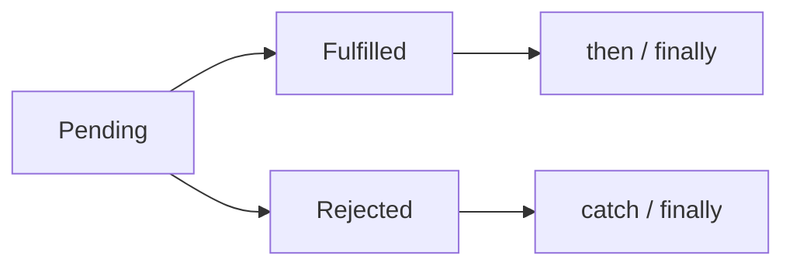

# CH-01: Future Promises (Asynchronous States)

> **"State machine asinkron yang memisahkan waktu penyelesaian dari waktu konsumsi hasil."**

**Source Hub**:
- [ECMA-262: Promise Objects](https://tc39.es/ecma262/#sec-promise-objects)

---

## 1. Mental Model: "The Energy Pager"

Promise adalah tiket hasil masa depan:
- **`pending`** berarti hasil belum tersedia.
- **`fulfilled`** berarti hasil datang dengan sukses.
- **`rejected`** berarti jalur gagal dan membawa alasan kegagalan.

---

## 2. Visualisasi Sistem: Promise State Flow

---

## 3. Mekanisme & Hubungan

1. Promise memisahkan produksi hasil dari pemasangan handler.
2. Reaksi `.then()` dan `.catch()` dijadwalkan sebagai microtask jobs.
3. Inilah sebabnya urutan output Promise sering tampak "mundur" dibanding ekspektasi sinkron.

---

## 4. Lab Praktis

Buka file `examples/01_promise_demo.js` untuk melihat transisi state dan prioritas microtask terhadap macrotask.

---

## 5. Arsitek Mindset: Aliran Linier

- Gunakan Promise untuk memisahkan definisi kerja asinkron dari cara mengonsumsinya.
- Pastikan jalur gagal selalu memiliki penanganan eksplisit.
- Pahami model job queue agar tidak salah membaca urutan eksekusi.

---
*Status: [x] Complete | [status.md](../../../docs/status.md)*
