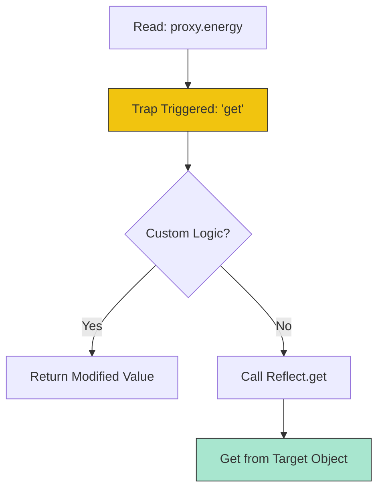

# CH-02: Reflection and Proxies

> **"Kaca spion dan filter transmisi. `Reflection and Proxies` adalah alat meta-programming Hub untuk memantau dan mematikan operasi internal."**

**Source Hub**: 
- [ECMA-262: Proxy Objects](https://tc39.es/ecma262/#sec-proxy-objects)
- [ECMA-262: Reflection](https://tc39.es/ecma262/#sec-reflection)

---

## 1. Konsep & Esensi

**Definisi Arsitek**:
**Proxy** adalah objek eksotis yang membungkus objek lain (target) dan memungkinkan Anda menginterupsi operasi dasarnya (seperti `get`, `set`, `apply`) melalui **Traps**. **Reflect** adalah objek statis yang menyediakan metode yang sama dengan traps tersebut, memudahkan penerusan operasi asli ke target.

**Model Mental**:
- **Proxy**: Petugas keamanan di depan pintu laci (Object). Setiap kali Anda ingin mengambil atau menaruh barang, petugas itu memeriksa izin Anda (Trap).
- **Reflect**: Buku panduan resmi petugas keamanan tersebut untuk melakukan prosedur standar pengambilan barang dengan benar.

---

## 2. Visualisasi Sistem: Proxy Trap Flow

---

## 3. Mekanisme & Hubungan

### Meta-Programming Protocol (Clause 27-28)
1. **The Invariants**: Ada batasan ketat dalam Proxy. Jika target objek sudah dibekukan (`non-configurable`), Proxy tidak boleh berbohong tentang statusnya. Ini menjaga integritas kejujuran sirkuit Hub.
2. **Reflect Methods**: Memberikan cara yang lebih konsisten untuk melakukan operasi internal. Misalnya, `Reflect.set` mengembalikan nilai boolean (Berhasil/Gagal), berbeda dengan penugasan biasa yang mengembalikan nilai yang diset.
3. **Introspection**: `Reflect.ownKeys` memungkinkan Hub mengambil seluruh kunci (String + Symbol) dalam satu langkah audit yang bersih.

### Arsitek Mindset: Defensive Interception
- Gunakan Proxy untuk membuat sistem reaktif (seperti yang dilakukan oleh framework UI modern) atau untuk validasi schema data secara real-time. Namun, gunakanlah secara bijak; Proxy memiliki overhead performa karena setiap akses harus melewati sirkuit "Trap" tambahan.

---

## 4. Lab Praktis
Buka file `examples/01_proxy_validation_lab.js` untuk membuat sistem log otomatis yang mencatat setiap kali sebuah properti objek sensitif diakses atau diubah.

---
*Status: [x] Complete | [status.md](../../../docs/status.md)*
