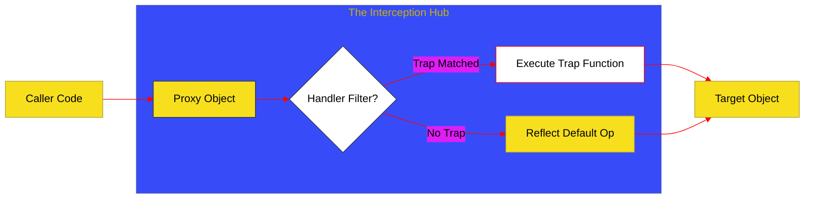

# BK-07: Reflection & Proxies (Clause 28)

> **"Kamera Introspeksi & Interupsi: Bagaimana Hub Melakukan Meta-Programming melalui Refleksi Objek dan Pengalihan Sinyal Internal (Proxies)."**

---

## 🌓 1. Essence: The Narrative

### Dual Definition
- **Formal**: Spesifikasi mengenai objek **Proxy** (yang mendefinisikan perilaku kustom untuk operasi fundamental) dan objek **Reflect** (kumpulan metode statis untuk memicu operasi fundamental yang sama secara terprogram). Mencakup mekanisme **Internal Method Interception** melalui serangkaian **Traps**.
- **Analogi**: Bayangkan sebuah **Resepsionis Hotel**. Jika Anda ingin masuk ke kamar (mengakses properti objek), Anda tidak langsung ke pintu. Anda melewati resepsionis (**Proxy**). Resepsionis bisa memeriksa identitas Anda (**Get Trap**), mencatat siapa yang datang (**Logging**), atau bahkan berbohong bahwa kamar sedang dibersihkan (**Interception**). **Reflect** adalah buku panduan prosedur hotel yang digunakan resepsionis untuk melakukan tugas standar jika tidak ada instruksi khusus yang diberikan.

---

## 🗺️ 2. Visual Logic: The Proxy Trap Interception Flow

Bagaimana Proxy berdiri di antara pemanggil dan target objek:

---

## 🏛️ 3. Strategic Chapters (Levels 5)

Meta-programming dan introspeksi:

1.  **[CH-01: Proxy Mechanics and Traps](./CH-03_ReflectProxy/)**
    *Konstruksi Proxy: Target, Handler, dan 13 jenis Trap internal (get, set, has, dll).*
2.  **[CH-02: Reflective Utility Hub](./CH-02_ReflectiveHub/)**
    *Infrastruktur Reflect: Mengapa Reflect lebih aman daripada operator Object konvensional.*

---

## 🧠 4. Under-the-hood: The "Target Invariant"
Proxy tidak bebas melakukan apa saja. Hub memberlakukan aturan ketat yang disebut **Invariants**. Misalnya, jika properti target bersifat non-configurable dan non-writable, trap `get` pada Proxy tidak boleh mengembalikan nilai yang berbeda dari nilai aslinya. Jika Proxy melanggar aturan ini, Hub akan melempar `TypeError`. Ini memastikan bahwa Proxy tetap menjaga integritas dasar dari objek yang ia wakili.

---

## 🎖️ 5. The Gold Standard Checklist
- [x] **Spec-Alignment**: Sinkronisasi dengan Clause 28 (Proxy, Reflect).
- [x] **Visual Logic**: Mermaid diagram untuk Proxy Interception.
- [x] **Consolidation**: Pembersihan materi "FuturePromises" yang telah dipindah ke BK-06.

---
*Buku Status: [x] Complete | [status.md](../../docs/status.md) | Kembali ke [SR-07](../README.md)*
