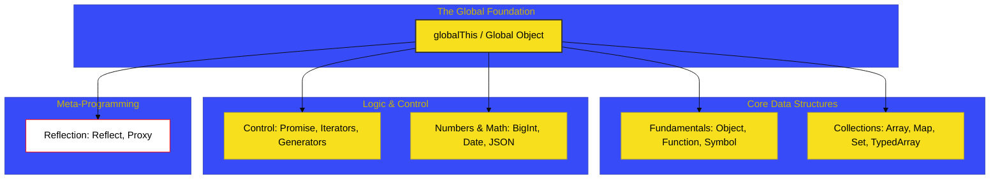

# SR-07: Standard Built-in Universe

> **"Perpustakaan & Gudang Suku Cadang: Kumpulan Komponen Standar yang Selalu Tersedia untuk Membangun Arsitektur Kompleks."**

---

## 🔗 Source Hub
- **Primary Source**: [ECMA-262: Standard Built-in ECMAScript Objects (Clause 19-28)](https://tc39.es/ecma262/#sec-standard-built-in-ecmascript-objects)
- **Technical Reference**: [MDN Web Docs: Standard built-in objects](https://developer.mozilla.org/en-US/docs/Web/JavaScript/Reference/Global_Objects)

---

## 🌓 1. Essence: The Narrative

### Dual Definition
- **Formal**: Spesifikasi mengenai koleksi **Intrinsics** dan objek standar yang disediakan secara bawaan oleh engine ECMAScript. Setiap objek di dalam "Universe" ini memiliki kontrak internal yang ketat, slot internal khusus, dan terdaftar di dalam **Realm Record** saat runtime diinisialisasi.
- **Analogi**: Bayangkan sebuah **Laboratorium Kimia Standar** (Runtime). Sebelum Anda melakukan eksperimen (menjalankan aplikasi), laboratorium sudah menyediakan peralatan dasar: tabung reaksi (**Array**), gelas ukur (**Number/Math**), dan buku catatan data (**Map/Set**). Peralatan ini selalu ada di sana, siap digunakan kapan saja tanpa perlu Anda bawa dari luar.

---

## 🗺️ 2. Visual Logic: The Built-in Ecosystem
Pemetaan domain objek bawaan berdasarkan fungsinya dalam spesifikasi:

---

## 🏛️ 3. Strategic Books (The Tracks)

1.  **[BK-01: Global Infrastructure](./BK-01_GlobalInfra/)**
    *Inisialisasi global object, intrinsics, dan globalThis.*
2.  **[BK-02: Fundamental Objects](./BK-02_FundamentalObjects/)**
    *Kontrak sakral Object, Function, dan Error handling.*
3.  **[BK-03: Numbers & Dates](./BK-03_NumbersDates/)**
    *Komputasi presisi, BigInt, dan sinkronisasi waktu.*
4.  **[BK-04: Text & Collections](./BK-04_TextCollections/)**
    *Manipulasi teks, RegExp, dan struktur data koleksi modern.*
5.  **[BK-05: Structured Data](./BK-05_StructuredData/)**
    *Binary data: ArrayBuffer, TypedArrays, dan integrasi JSON.*
6.  **[BK-06: Control Abstractions](./BK-06_ControlAbstractions/)**
    *Lifecycle Promise, Iterator protocols, dan alur asinkron.*
7.  **[BK-07: Reflection & Proxies](./BK-07_ReflectionProxies/)**
    *Meta-programming hub: Reflect dan Proxy mechanics.*

---

## 🧠 4. Under-the-hood: Realm Intrinsics
Di SR-07, kita tidak hanya belajar cara menggunakan `Array`, tapi bagaimana `Array` terdaftar sebagai **Intrinsic Object** di dalam `[[Intrinsics]]` field pada sebuah **Realm Record**. Inilah alasan mengapa `[] instanceof Array` bisa mengembalikan `false` jika array tersebut berasal dari "dunia lain" (seperti iframe yang berbeda), karena setiap Realm memiliki set intrinsiknya sendiri.

---
*Status: [/] Reconstruction in Progress. Mengacu pada Blueprint RAK-04.*
