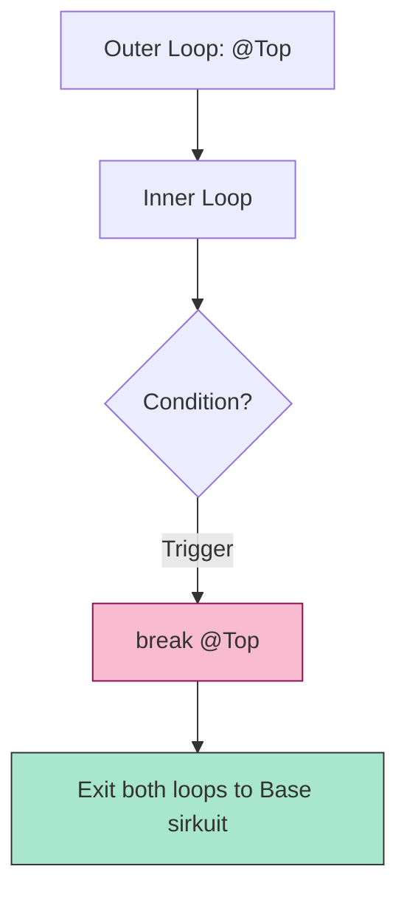

# CH-01: Control Transfer and Signal Interrupts

> **"Navigasi antar sirkuit yang presisi. `Control Transfer and Signal Interrupts` adalah perintah yang memungkinkan teknisi Hub melompat keluar dari alur linear."**

**Source Hub**: 
- [ECMA-262: Return Statement](https://tc39.es/ecma262/#sec-return-statement)
- [ECMA-262: Break and Continue](https://tc39.es/ecma262/#sec-break-statement)

---

## 1. Konsep & Esensi

**Definisi Arsitek**:
**Control Transfer** adalah mekanisme untuk mengalihkan eksekusi dari satu titik sirkuit ke titik lain di luar alur normal. **`return`** keluar dari fungsi, **`break`** keluar dari loop/switch, dan **`continue`** melompat ke putaran loop berikutnya. **Labels** menyediakan "Alamat Lompatan" untuk operasi break/continue di dalam sirkuit yang kompleks.

**Model Mental**:
Bayangkan Hub sebagai jalur kereta api.
- **Normal Flow**: Kereta berjalan lurus dari Stasiun A ke B.
- **Control Transfer**: Wesel (Switch) yang memindahkan kereta ke jalur lain atau memaksanya berhenti di tengah jalan.

---

## 2. Visualisasi Sistem: Labelled Break Logic

---

## 3. Mekanisme & Hubungan

### Jenis Interupsi
1. **return (Clause 14.10)**: Menghentikan eksekusi fungsi dan mengembalikan **Completion Record** bertipe `return`. Ini akan memicu sirkuit `finally` jika ada di jalur keluar.
2. **break / continue (Clause 14.9 & 14.8)**: Mengirimkan signal interupsi ke sirkuit iterasi terdekat. Jika menggunakan `label`, signal dikirim ke sirkuit yang ditandai dengan label tersebut.
3. **with (Clause 14.11)**: Menambahkan objek ke puncak scope chain (Sangat tidak disarankan karena merusak prediktabilitas energi Hub).

### Arsitek Mindset: Clean Exits
- Gunakan `return` lebih awal (**Guard Clauses**) untuk menghindari percabangan `if-else` yang terlalu dalam. Ini membuat aliran energi di Hub lebih mudah dibaca dan divalidasi oleh teknisi lain.

---

## 4. Lab Praktis
Buka file `examples/control_transfer_lab.js` untuk melihat bagaimana `break @label` bekerja dalam menghentikan loop tiga tingkat secara instan.

---
*Status: [status.md](../../../../../status.md)*
