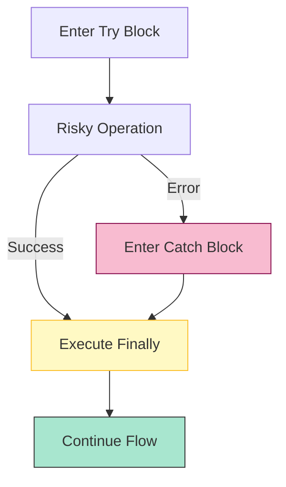

# CH-02: Exception Handling and Throwing

> **"Manajemen kegagalan sistem. `Exception Handling and Throwing` adalah protokol darurat Hub untuk mengisolasi error dan mencegah pemadaman total sirkuit."**

**Source Hub**: 
- [ECMA-262: Try Statement](https://tc39.es/ecma262/#sec-try-statement)
- [ECMA-262: Throw Statement](https://tc39.es/ecma262/#sec-throw-statement)

---

## 1. Konsep & Esensi

**Definisi Arsitek**:
**Throw** adalah aksi pelepasan sinyal error secara eksplisit. **Try-Catch-Finally** adalah struktur untuk membungkus sirkuit yang berisiko tinggi. Jika error terjadi di dalam `try`, Hub akan mengalihkan aliran ke `catch`. Blok `finally` dijamin akan dieksekusi terlepas dari apakah error terjadi atau tidak.

**Model Mental**:
- **Throw**: Menekan tombol alarm darurat.
- **Try-Catch**: Memasang kotak sekring. Jika arus berlebih (Error), sekring putus (Catch) tapi rumah tidak terbakar.
- **Finally**: Protokol pembersihan (Cleaning) yang harus dilakukan, baik saat listrik menyala maupun padam.

---

## 2. Visualisasi Sistem: Try-Catch-Finally Lifecycle

---

## 3. Mekanisme & Hubungan

### Protokol Keselamatan (Clause 14.15)
1. **The Catch Record**: Saat error ditangkap, Hub menciptakan Environment Record baru untuk menyimpan objek error tersebut (hanya tersedia di dalam blok catch).
2. **The Finally Guarantee**: Blok `finally` adalah sirkuit yang sangat kuat. Jika Anda melakukan `return` di dalam `try` tapi ada `finally`, Hub akan menjalankan `finally` TERLEBIH DAHULU sebelum benar-benar mengembalikan nilai.
3. **Throw (Clause 14.14)**: Anda bisa melempar nilai apa pun (Energi Mentah), namun arsitektur Grid yang baik selalu melempar objek yang merupakan turunan dari `%Error%`.

### Arsitek Mindset: Error Bubbling
- Sadari bahwa error yang tidak ditangkap akan terus naik (Bubble up) ke tumpukan eksekusi berikutnya sampai ia menemukan blok `try` atau mencapai tingkat Global (dimana ia akan mematikan Agent tersebut). Selalu pasang sirkuit pengaman di pintu masuk utama aplikasi Anda.

---

## 4. Lab Praktis
Buka file `examples/exception_flow_lab.js` untuk melihat eksperimen urutan eksekusi antara `return` di dalam Catch vs `return` di dalam Finally.

---
*Status: [status.md](../../../../../status.md)*
