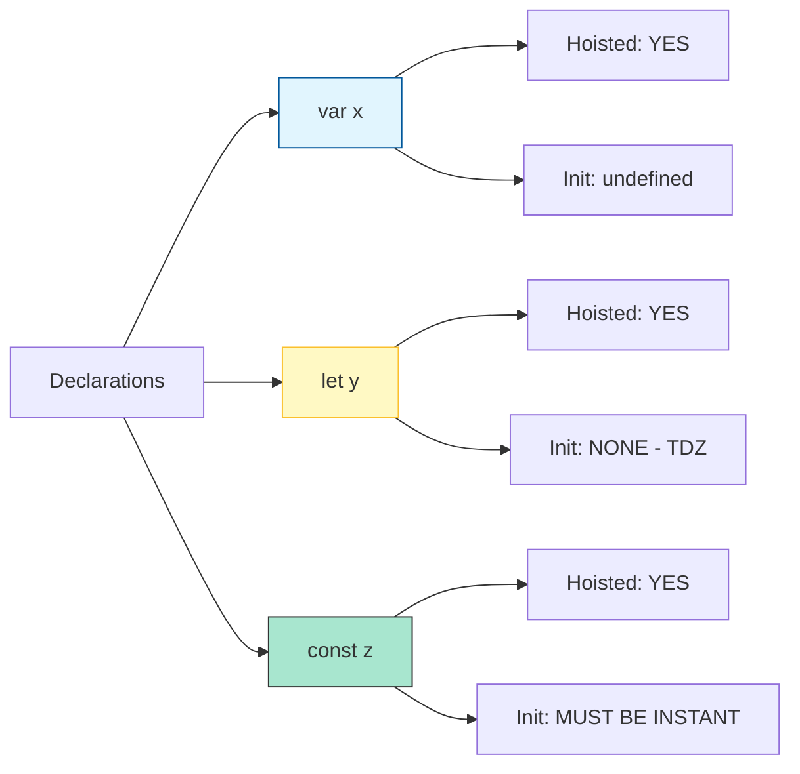

# CH-01: Variable Bindings and Hoisting

> **"Pendaftaran identitas di dalam sirkuit. `Variable Bindings and Hoisting` adalah proses Hub dalam memesan ruang di memori bahkan sebelum kode dieksekusi."**

**Source Hub**: 
- [ECMA-262: Declarative Environment Records](https://tc39.es/ecma262/#sec-declarative-environment-records)
- [ECMA-262: Hoisting](https://tc39.es/ecma262/#sec-variable-statement)

---

## 1. Konsep & Esensi

**Definisi Arsitek**:
**Binding** adalah asosiasi antara sebuah Identifier (nama) dengan sebuah nilai di dalam Environment Record. **Hoisting** adalah mekanisme di mana Hub memindahkan pendaftaran deklarasi ke puncak lingkupnya selama fase persiapan konteks eksekusi. `var` diinisialisasi dengan `undefined`, sedangkan `let` dan `const` tetap tidak terinisialisasi (**TDZ**).

**Model Mental**:
Bayangkan Hub sebagai asrama.
- **Hoisting**: Sebelum mahasiswa datang, nama-nama mereka sudah terdaftar di daftar pintu kamar (Pendaftaran Identitas).
- **Initialization**: Mahasiswa tersebut benar-benar masuk ke kamar (Pengikatan Nilai).
- **TDZ**: Pintu kamar terkunci sampai mahasiswa tersebut membawa kunci pendaftaran resminya.

---

## 2. Visualisasi Sistem: Hoisting Comparison Matrix

---

## 3. Mekanisme & Hubungan

### Tiga Aliansi Variabel
1. **VariableStatement (`var`)**: Memasukkan binding ke dalam `VariableEnvironment`. Ia bisa dideklarasikan ulang tanpa error, yang sering menyebabkan "Polusi Sirkuit" di Hub.
2. **LexicalDeclaration (`let`, `const`)**: Memasukkan binding ke dalam `LexicalEnvironment`. Mereka bersifat blok-scoped. `const` menambahkan batasan bahwa penugasan ulang akan memicu **TypeError**.
3. **Hoisting Mechanics**: Hub melakukan pemindaian awal (**Static Analysis**) untuk menemukan semua deklarasi sebelum mengevaluasi baris pertama kode.

### Arsitek Mindset: Defensive Bindings
- Selalu gunakan `const` sebagai standar default untuk menjaga integritas data. Gunakan `let` hanya jika sirkuit memang didesain untuk mengubah muatan energinya di tengah jalan. Hindari `var` untuk mencegah kebocoran sirkuit ke luar blok yang tidak diinginkan.

---

## 4. Lab Praktis
Buka file `examples/binding_lifecycle_lab.js` untuk melihat eksperimen Temporal Dead Zone dan bagaimana Hub menolak akses ke variabel `let` sebelum baris deklarasinya.

---
*Status: [status.md](../../../../../status.md)*
