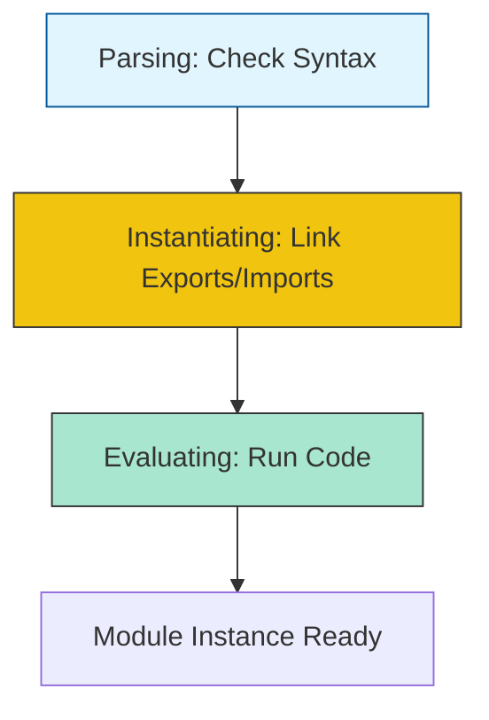

# CH-02: Scripts and Modules

> **"Organisasi unit energi massal. `Scripts and Modules` menjelaskan bagaimana Hub memuat, menghubungkan, dan mengeksekusi file kode dalam skala besar."**

**Source Hub**: 
- [ECMA-262: Scripts](https://tc39.es/ecma262/#sec-scripts)
- [ECMA-262: Modules](https://tc39.es/ecma262/#sec-modules)

---

## 1. Konsep & Esensi

**Definisi Arsitek**:
**Script** adalah unit kode tradisional yang berjalan di scope global. **Module** (ESM) adalah unit kode modern yang memiliki scope sendiri, mendukung pemuatan asinkron, dan diwajibkan menggunakan mode ketat (**Strict Mode**) secara otomatis. Modul menghubungkan sirkuit melalui perintah `export` dan `import`.

**Model Mental**:
- **Script**: Kabel listrik terbuka yang tersambung ke seluruh rumah. Siapa pun bisa menambahkan beban ke kabel itu.
- **Module**: Sebuah komponen kotak hitam tertutup. Ia punya terminal input (Import) dan output (Export) yang jelas. Energi di dalamnya terisolasi dari komponen lain.

---

## 2. Visualisasi Sistem: Module Lifecycle

---

## 3. Mekanisme & Hubungan

### Karakteristik Modul (Clause 15.2)
1. **Static Links**: Hub menghubungkan impor dan ekspor SEBELUM kode dijalankan. Ini memungkinkan Hub melakukan optimasi "Tree Shaking" (membuang sirkuit yang tidak terpakai).
2. **Strict by Default**: Seluruh kode di dalam modul berjalan dalam Strict Mode untuk menjamin keamanan dan performa maksimal.
3. **Circular Dependencies**: Hub mampu menangani modul yang saling merujuk satu sama lain melalui mekanisme penangguhan evaluasi sampai jalur koneksi selesai dipetakan.

### Arsitek Mindset: Modular Boundaries
- Rancanglah Hub Anda sebagai kumpulan modul kecil yang memiliki tanggung jawab tunggal. Dengan menjaga sirkuit tetap modular, Anda memudahkan proses audit, pengujian, dan pemeliharaan jangka panjang tanpa merusak stabilitas Grid global.

---

## 4. Lab Praktis
Buka file `examples/module_linkage_lab.js` untuk melihat bagaimana Hub menangani siklus impor antara dua modul dan bagaimana variabel ekspor bersifat *Live Binding* (bukan salinan).

---
*Status: [status.md](../../../../../status.md)*
