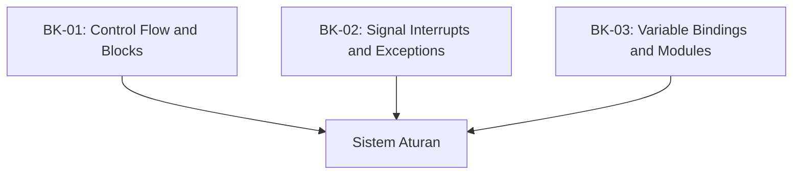

# SR-08: Statements and Declarations (The System Rules)

> **"Aturan main dan kontrol aliran di dalam Grid. SR-08 membedah 'Pernyataan dan Deklarasi' (The System Rules)—instruksi yang mengatur bagaimana energi diarahkan dan dibatasi."**

**Source Hub**: 
- [ECMA-262: Statements and Declarations](https://tc39.es/ecma262/#sec-ecmascript-language-statements-and-declarations)

---

## 🏗️ The 3 Pillars of Statement Architecture

---

## Koleksi Buku:
1.  **[BK-01: Control Flow and Blocks](./BK-01_ControlFlow/)**: Blok lingkup (Block), pemilihan (If/Switch), dan pengulangan (Loops).
2.  **[BK-02: Signal Interrupts and Exceptions](./BK-02_Interrupts/)**: Interupsi aliran (Return, Break, Continue) dan penanganan error (Try/Catch).
3.  **[BK-03: Variable Bindings and Modules](./BK-03_Bindings/)**: Deklarasi variabel (`let`, `const`, `var`) dan struktur modular tingkat tinggi.

---
*Status: [status.md](../../status.md) | Back to [RAK-04](../README.md)*
