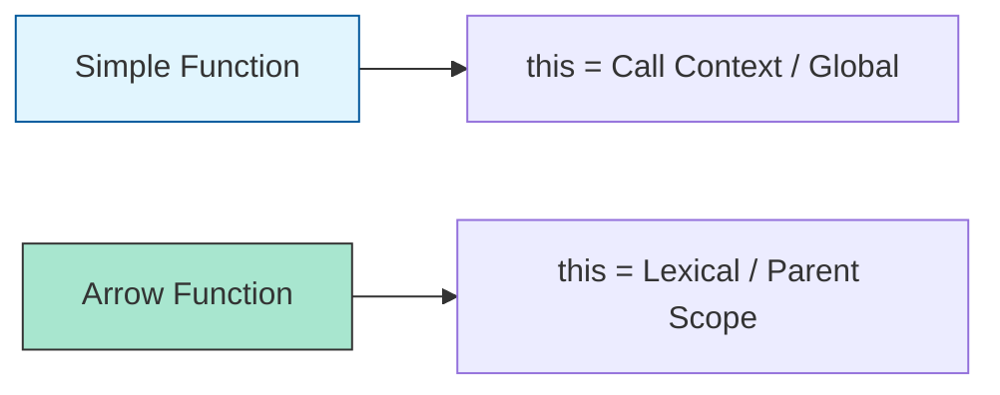

# CH-01: Ordinary and Arrow Functions

> **"Unit pemroses standar. `Ordinary and Arrow Functions` adalah reaktor utama yang mengubah input menjadi output melalui algoritma yang terdefinisi."**

**Source Hub**: 
- [ECMA-262: Function Definitions](https://tc39.es/ecma262/#sec-function-definitions)

---

## 1. Konsep & Esensi

**Definisi Arsitek**:
**Function Declaration** adalah pernyataan yang mendaftarkan binding fungsi ke Environment Record saat fase inisialisasi. **Arrow Functions** adalah unit eksotis yang tidak memiliki `this`, `arguments`, `super`, atau `new.target` sendiri (bersifat leksikal).

**Model Mental**:
- **Ordinary Function**: Mesin pabrik lengkap dengan panel kontrol sendiri (Internal This).
- **Arrow Function**: Alat tambahan (Probe) yang tidak punya panel kontrol; ia meminjam kontrol dari ruangan tempat ia dipasang.

---

## 2. Visualisasi Sistem: This Binding Comparison

---

## 3. Mekanisme & Hubungan

### Arsitektur Fungsi (Clause 15.1, 15.3)
1. **Evaluation**: Saat Hub mengevaluasi deklarasi fungsi, ia menciptakan objek fungsi baru melalui `OrdinaryFunctionCreate`.
2. **Strict Mode**: Fungsi bisa memiliki mode eksekusi sendiri (`"use strict"`) yang berbeda dari sirkuit induknya.
3. **Hoisting**: Berbeda dengan variabel `let`, deklarasi fungsi dipindahkan ke puncak scope dengan nilai yang sudah terisi (Siap digunakan seketika).

### Arsitek Mindset: Choosing the Right Tool
- Gunakan Ordinary Functions untuk metode objek yang membutuhkan akses ke properti saudara (`this`). Gunakan Arrow Functions untuk callback dan sirkuit logika murni yang tidak ingin mengganggu konteks `this` yang sudah ada.

---

## 4. Lab Praktis
Buka file `examples/01_function_arrow_comparison.js` untuk membuktikan perbedaan nilai `this` antara fungsi biasa dan arrow function.

---
*Status: [x] Complete | [status.md](../../../../../status.md)*
