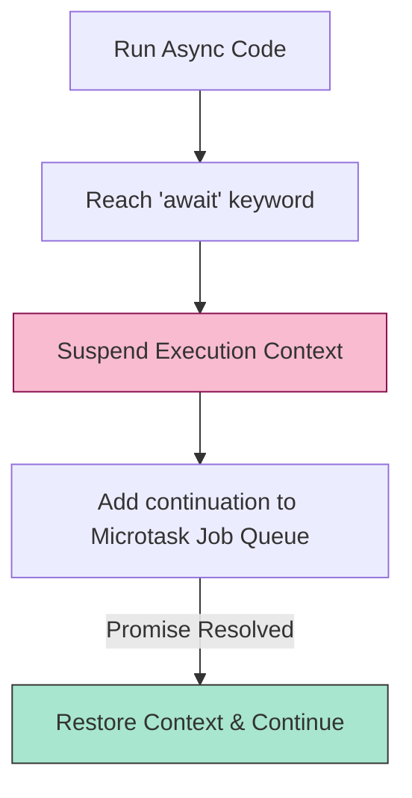

# CH-01: Generator and Async Foundations

> **"Reaktor yang dapat dijeda. `Generator and Async Foundations` mendefinisikan sirkuit fleksibel yang memungkinkan aliran energi berhenti dan berlanjut sesuai kebutuhan."**

**Source Hub**: 
- [ECMA-262: Generator Function Definitions](https://tc39.es/ecma262/#sec-generator-function-definitions)
- [ECMA-262: Async Function Definitions](https://tc39.es/ecma262/#sec-async-function-definitions)

---

## 1. Konsep & Esensi

**Definisi Arsitek**:
**Generators** (`function*`) adalah fungsi yang mengembalikan objek Generator. Ia bisa menghentikan eksekusinya sendiri melalui kata kunci `yield`. **Async Functions** adalah fungsi yang selalu mengembalikan Promise dan bisa menunda eksekusi melalui `await` sampai muatan energi (Promise) tersebut terpenuhi (*resolved*).

**Model Mental**:
- **Generator**: Sebuah kaset tape. Anda bisa memutar (Run), menekan tombol Stop (Yield), lalu melanjutkannya lagi (Next) kapan saja.
- **Async**: Sebuah pesanan antar. Anda mengirim permintaan (Promise) lalu duduk menunggu (Await). Begitu kurir datang dengan data, Anda melanjutkan pekerjaan.

---

## 2. Visualisasi Sistem: Async Re-entry Logic

---

## 3. Mekanisme & Hubungan

### Mesin State (Clause 15.5, 15.7)
1. **[[GeneratorState]]**: Slot internal ini melacak apakah generator sedang `suspendedStart`, `suspendedYield`, `executing`, atau `completed`. Saat di-yield, seluruh status Call Stack dibekukan dan disimpan di sini.
2. **Async Algorithm**: Saat `await` dipanggil, Hub secara implisit membuat Promise baru (jika belum ada) dan mendaftarkan sisa fungsi sebagai "Continuation Job".
3. **Promise Wrapper**: Setiap nilai yang dikembalikan dari fungsi `async` secara otomatis dibungkus oleh algoritma `PromiseResolve`.

### Arsitek Mindset: Non-Blocking Architecture
- Gunakan `async/await` untuk menjaga Hub tetap responsif. Jangan biarkan sirkuit berat (seperti I/O data) memblokade eksekusi utama. Dengan menggunakan sirkuit asinkron, Hub bisa mengerjakan tugas lain saat menunggu energi datang dari sirkuit eksternal.

---

## 4. Lab Praktis
Buka file `examples/01_async_v_generator_lab.js` untuk melihat perbedaan bentuk alur antara generator dan async function.

---
*Status: [x] Complete | [status.md](../../../../../status.md)*
