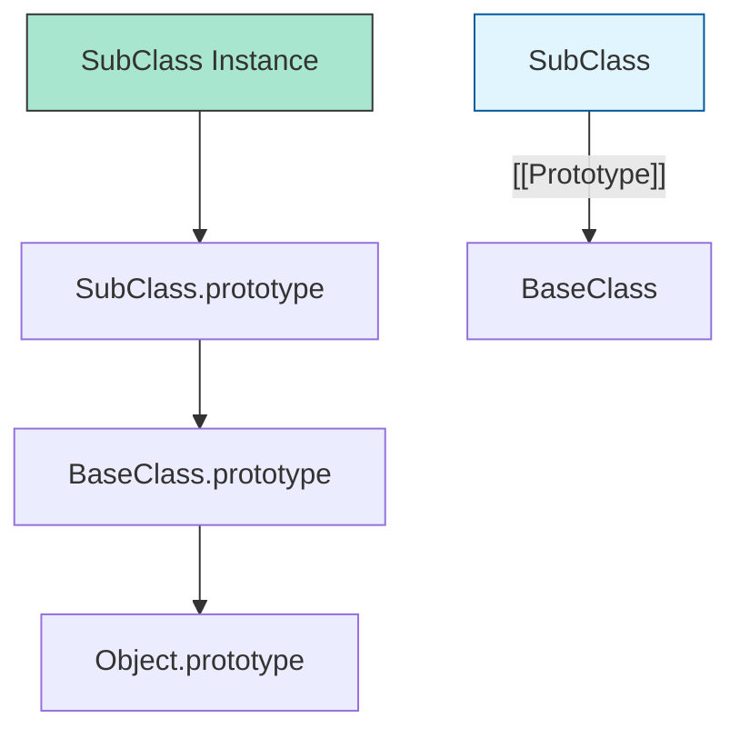

# CH-01: Class Definitions and Heritage

> **"Arsitektur cetak biru Hub. `Class Definitions and Heritage` adalah sistem untuk menciptakan struktur data yang kompleks dengan garis keturunan yang terdefinisi."**

**Source Hub**: 
- [ECMA-262: Class Definitions](https://tc39.es/ecma262/#sec-class-definitions)

---

## 1. Konsep & Esensi

**Definisi Arsitek**:
**Class** di ECMAScript adalah "Syntactic Sugar" di atas pola prototipe, namun dengan batasan yang lebih ketat. Kelas selalu berjalan dalam **Strict Mode** dan metodenya bersifat non-enumerable secara default. **Heritage** (`extends`) mendefinisikan hubungan prototipe antara kelas anak dan kelas induk.

**Model Mental**:
- **Class**: Desain Blueprint sebuah gedung.
- **Constructor**: Tim konstruksi yang membangun gedung berdasarkan blueprint tersebut.
- **Extends**: Penambahan lantai atau fitur baru pada desain blueprint lama tanpa harus menggambar ulang desain aslinya.

---

## 2. Visualisasi Sistem: Class Prototypal Chain

---

## 3. Mekanisme & Hubungan

### Komponen Blueprint (Clause 15.10.1)
1. **The Constructor**: Metode khusus yang dipanggil saat `new` dijalankan. Jika sirkuit ini adalah sub-kelas, ia wajib memanggil `super()` untuk mengaktifkan sirkuit induk sebelum bisa menggunakan `this`.
2. **Private Fields (#)**: Inovasi modern di Hub. Variabel ini tidak bisa diakses dari luar sirkuit kelas, memberikan isolasi data tingkat tinggi yang sebelumnya sulit dicapai.
3. **Static Methods/Fields**: Sirkuit yang terikat langsung pada Blueprint (Class), bukan pada unit gedung (Instance) yang dibangun darinya.

### Arsitek Mindset: The "super" Constraint
- Jangan pernah lupa memanggil `super()` di sub-kelas. Di level spesifikasi, objek `this` baru benar-benar diciptakan oleh kelas induk tertinggi. Sub-kelas hanya "meminjam" dan memodifikasi objek tersebut. Kegagalan memanggil `super()` akan memicu pemutusan sirkuit (ReferenceError).

---

## 4. Lab Praktis
Buka file `examples/01_class_inheritance_lab.js` untuk membedah bagaimana rantai prototipe diciptakan saat menggunakan `extends`.

---
*Status: [x] Complete | [status.md](../../../../../status.md)*
