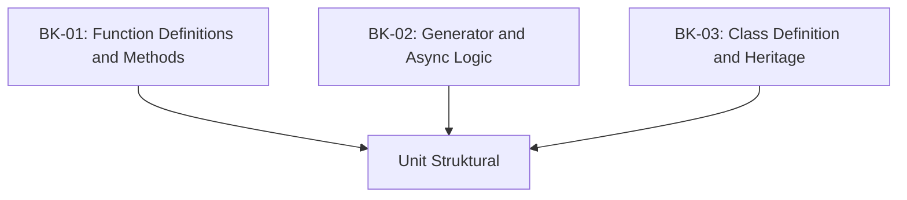

# SR-09: Functions and Classes (The Structural Units)

> **"Arsitektur Unit Pemroses dan Blueprint Data. SR-09 membedah 'Fungsi dan Kelas' (The Structural Units)—bagaimana logika dibungkus dan struktur data diwariskan."**

**Source Hub**: 
- [ECMA-262: Function and Class Definitions](https://tc39.es/ecma262/#sec-ecmascript-language-functions-and-classes)

---

## 🏗️ The 3 Pillars of Structural Architecture

---

## Koleksi Buku:
1.  **[BK-01: Function Definitions and Methods](./BK-01_Functions/)**: Fungsi normal, Arrow functions, dan definisi metode di dalam objek.
2.  **[BK-02: Generator and Async Logic](./BK-02_GeneratorsAsync/)**: Sirkuit yang dapat dijeda (Generator) dan aliran asinkron (Async).
3.  **[BK-03: Class Definition and Heritage](./BK-03_Classes/)**: Blueprint objek modern dan mekanisme pewarisan (Extends).

---
*Status: [status.md](../../status.md) | Back to [RAK-04](../README.md)*
