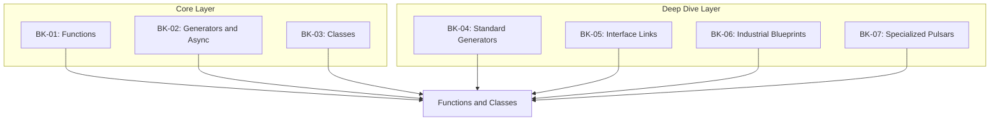

# SR-09: Functions and Classes (The Structural Units)

> **"Bagaimana logika dibungkus, dijeda, dan diwariskan di dalam Grid."**

**Source Hub**:
- [ECMA-262: Function and Class Definitions](https://tc39.es/ecma262/#sec-ecmascript-language-functions-and-classes)

---

## The 7-Book Structural Architecture

---

## Koleksi Buku
1. **[BK-01: Function Definitions and Methods](./BK-01_Functions/)**: function biasa, arrow function, metode, dan accessor.
2. **[BK-02: Generator and Async Logic](./BK-02_GeneratorsAsync/)**: generator, async function, dan async iteration.
3. **[BK-03: Class Definition and Heritage](./BK-03_Classes/)**: class, `extends`, `super`, dan private elements.
4. **[BK-04: Standard Generators](./BK-04_StandardGenerators/)**: pendalaman model fungsi dasar, arrow units, dan binding `this`.
5. **[BK-05: Interface Links](./BK-05_InterfaceLinks/)**: pendalaman method definitions serta get/set sebagai konektor data.
6. **[BK-06: Industrial Blueprints](./BK-06_IndustrialBlueprints/)**: pendalaman konstruksi class dan rantai heritage.
7. **[BK-07: Specialized Pulsars](./BK-07_SpecializedPulsars/)**: pendalaman generator khusus dan async pulsars.

---

## Catatan Audit Struktur

`SR-09` kini diperlakukan sebagai sub-rak 7 buku:
- `BK-01` sampai `BK-03` adalah jalur inti untuk functions, async flow, dan classes.
- `BK-04` sampai `BK-07` adalah jalur pendalaman yang sebelumnya hidup sebagai struktur paralel dan kini dinormalisasi sebagai buku eksplisit.

---
*Status: [/] Partial | [status.md](../../status.md) | Back to [RAK-04](../README.md)*
