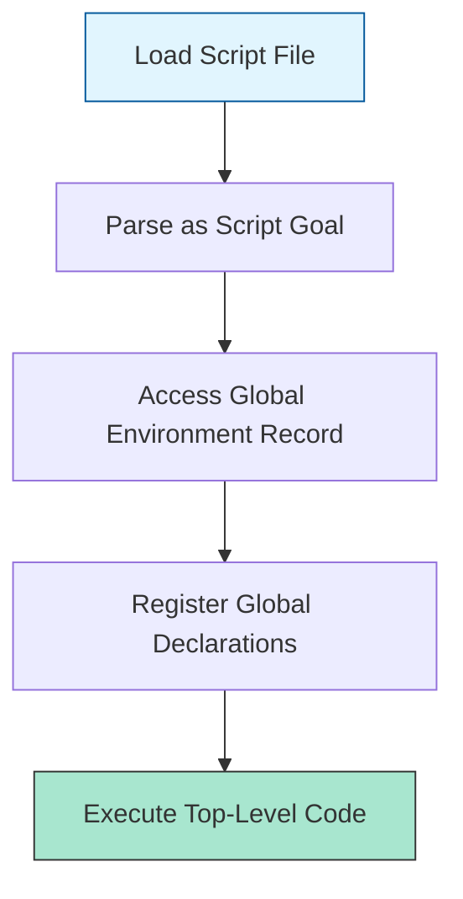

# CH-01: Script Evaluation and Global Host

> **"Akses langsung ke jantung Hub. `Script Evaluation and Global Host` mendefinisikan bagaimana kode mentah dijalankan tanpa isolasi tambahan."**

**Source Hub**: 
- [ECMA-262: Script Evaluation](https://tc39.es/ecma262/#sec-runtime-semantics-scriptevaluation)

---

## 1. Konsep & Esensi

**Definisi Arsitek**:
Sebuah **Script** adalah sepotong kode JavaScript yang dieksekusi di tumpukan global. Tidak seperti Modul, Skrip tidak memiliki isolasi level file; setiap variabel yang dideklarasikan dengan `var` akan langsung menempel pada objek Global (misal: `window`), yang bisa mengganggu sirkuit lain di Hub.

**Model Mental**:
Bayangkan Hub sebagai sebuah gedung besar.
- **Script**: Kabel listrik yang diletakkan di lantai koridor umum. Siapa pun yang lewat bisa menarik kabel itu atau tersandung (Konflik Nama).

---

## 2. Visualisasi Sistem: Script Initialization Flow

---

## 3. Mekanisme & Hubungan

### Karakteristik Eksekusi (Clause 15.1.1)
1. **Global Declaration Instantiation**: Hub memindai skrip untuk mencari `var` dan `function`. Jika ditemukan, mereka didaftarkan ke objek Global. Jika ada `let/const`, mereka didaftarkan ke *Declarative Environment Record* global.
2. **Host Interfacing**: Skrip seringkali bergantung pada Host (seperti `HTML Document`) untuk menyediakan sumber daya awal.
3. **No Automatic Strict**: Skrip berjalan dalam mode default (*Sloppy*) kecuali Anda secara eksplisit menambahkan `"use strict"`.

### Arsitek Mindset: The Peril of Global Pollutions
- Hindari penggunaan Skrip untuk aplikasi skala besar. Gunakan Skrip hanya untuk inisialisasi minimal atau penghubung (shims) tingkat rendah. Untuk pembangunan arsitektur yang kuat, selalu pilih sirkuit Modul yang memiliki dinding isolasi yang jelas.

---

## 4. Lab Praktis
Buka file `examples/script_global_leak_lab.js` untuk melihat bagaimana deklarasi `var` di satu skrip mencemari scope di skrip lainnya di dalam Hub yang sama.

---
*Status: [status.md](../../../../../status.md)*
