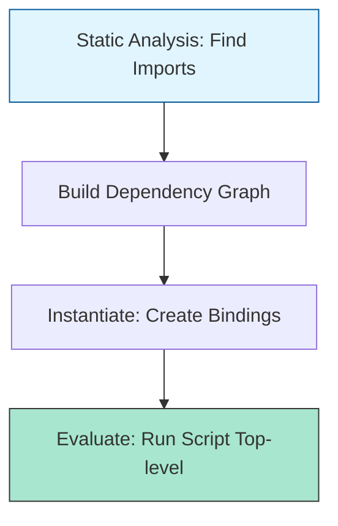

# CH-01: Module Records and Linkage

> **"Jaringan antar komponen yang terisolasi. `Module Records and Linkage` adalah protokol Hub untuk menghubungkan berbagai unit modular secara aman dan efisien."**

**Source Hub**: 
- [ECMA-262: Modules](https://tc39.es/ecma262/#sec-modules)

---

## 1. Konsep & Esensi

**Definisi Arsitek**:
Setiap file Modul direpresentasikan sebagai sebuah **Module Record**. Hub menghubungkan (link) modul-modul ini melalui serangkaian **Import Entries** dan **Export Entries**. Berbeda dengan skrip, modul memiliki **Module Environment Record** sendiri yang mengisolasi variabel internal dari Grid global.

**Model Mental**:
Bayangkan Hub sebagai stasiun luar angkasa.
- **Module**: Sebuah modul stasiun yang terisolasi.
- **Linkage**: Pintu *Air-lock* yang menghubungkan satu modul ke modul lainnya. Hanya barang yang secara eksplisit diletakkan di air-lock (Export) yang bisa diambil oleh modul tetangga (Import).

---

## 2. Visualisasi Sistem: Module Loading Cycles

---

## 3. Mekanisme & Hubungan

### Mekanisme Hub (Clause 15.2.1)
1. **Live Bindings**: Saat Anda mengimpor variabel dari modul lain, Anda tidak mendapatkan salinan, melainkan referensi langsung ke variabel tersebut. Jika variabel di modul asal berubah, nilai di modul pengimpor juga ikut berubah secara otomatis.
2. **Cyclic Dependencies**: Hub mampu menangani modul A mengimpor B dan B mengimpor A karena pemisahan fase *Instantiate* dan *Evaluate*. Sirkuit dibangun dulu (Linkage), baru energi dialirkan (Execution).
3. **Module Namespaces**: Import menggunakan `import * as name` menciptakan objek eksotis khusus yang membungkus seluruh ekspor dari modul tersebut.

### Arsitek Mindset: Static Optimization
- Karena struktur modul bersifat statis (tidak bisa berubah saat runtime), Hub bisa melakukan optimasi "Dead Code Elimination" dengan sangat baik. Rancanglah ekspor Anda secara spesifik (Named Exports) daripada ekspor massal agar Hub bisa mematikan sirkuit yang tidak benar-benar dikonsumsi oleh aplikasi Anda.

---

## 4. Lab Praktis
Buka file `examples/module_namespace_lab.js` untuk melihat bagaimana objek namespace modul berperilaku dan mengapa Anda tidak bisa mengubah nilainya dari luar.

---
*Status: [status.md](../../../../../status.md)*
