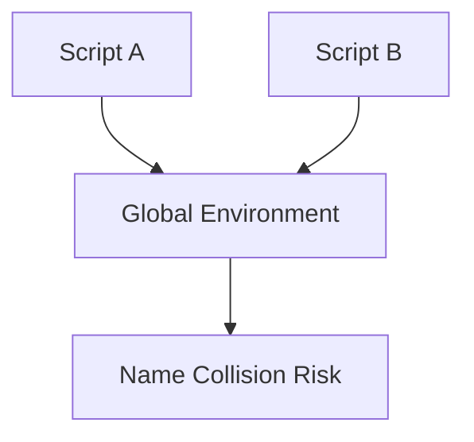

# CH-01: Open Circuits (Global Execution)

> **"Mode script klasik yang mengalir langsung ke jalur global tanpa isolasi file."**

**Source Hub**:
- [ECMA-262: Scripts](https://tc39.es/ecma262/#sec-scripts)
- [ECMA-262: ScriptEvaluation](https://tc39.es/ecma262/#sec-runtime-semantics-scriptevaluation)

---

## 1. Mental Model: "The Open Grid"

Dalam mode script klasik, semua unit berbagi koridor global yang sama:
- deklarasi `var` dan function dapat bocor ke level global,
- beberapa file script dapat saling memengaruhi tanpa kontrak impor-ekspor,
- urutan pemuatan host menjadi penentu stabilitas perilaku.

---

## 2. Visualisasi Sistem: Shared Script Grid

---

## 3. Mekanisme & Hubungan

1. Script diparse dengan **Script goal**, bukan Module goal.
2. Global declaration instantiation mendaftarkan binding global sebelum top-level code dijalankan.
3. Karena tidak ada isolasi file, konflik nama dan side effect lintas file menjadi risiko struktural.

---

## 4. Lab Praktis

Buka file `examples/01_open_circuits_lab.js` untuk melihat bagaimana script klasik berbagi jalur global dan mengapa itu rentan terhadap tabrakan sinyal.

---

## 5. Arsitek Mindset: Batasi Sirkuit Terbuka

- Gunakan script klasik hanya ketika host memang memaksanya.
- Minimalkan state top-level yang menyentuh global object.
- Perlakukan script sebagai compatibility layer, bukan fondasi utama arsitektur.

---
*Status: [x] Complete | [status.md](../../../docs/status.md)*
